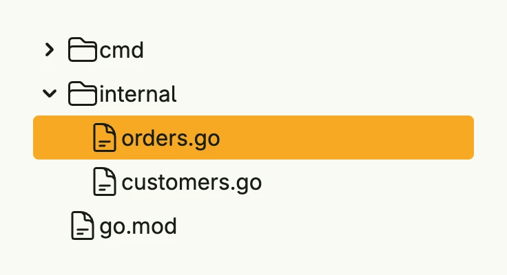

The tree view shows hierarchical data, e.g. folders or categories, with expandable nodes. The root node
itself is not shown. The expanded and selected nodes live in a separate `TreeStateModel`, so you can
rebuild the nodes on each render without losing that state.



```go
func view(wnd core.Window) core.View {
    type file = treeview.Node[string, string]

    root := &file{ID: "root", Label: "project", Icon: icons.Folder, Expandable: true, Children: []*file{
        {ID: "cmd", Label: "cmd", Icon: icons.Folder, Expandable: true, Children: []*file{
            {ID: "main.go", Label: "main.go", Icon: icons.DocumentText},
        }},
        {ID: "internal", Label: "internal", Icon: icons.Folder, Expandable: true, Children: []*file{
            {ID: "orders.go", Label: "orders.go", Icon: icons.DocumentText},
            {ID: "customers.go", Label: "customers.go", Icon: icons.DocumentText},
        }},
        {ID: "go.mod", Label: "go.mod", Icon: icons.DocumentText},
    }}

    state := core.AutoState[treeview.TreeStateModel[string]](wnd).Init(func() treeview.TreeStateModel[string] {
        return treeview.TreeStateModel[string]{
            Expanded: map[string]bool{"root": true, "internal": true},
            Selected: map[string]bool{"orders.go": true},
        }
    })

    return treeview.TreeView(root, state).
        Action(func(n *file) {
            // open the file n.ID
        }).
        Frame(Frame{Width: L320})
}
```

## Constructors

```go
func TreeView[T any, ID comparable](root *Node[T, ID], state *core.State[TreeStateModel[ID]]) TTreeView[T, ID]
```

TreeView creates a tree view for the given root node. The state holds which nodes are expanded and selected.

## Methods

| Method | Description |
|--------|-------------|
| `Action(fn func(*Node[T, ID])) TTreeView[T, ID]` | Action sets the callback which is invoked when a node is clicked. |
| `Expand(id ID, expanded bool)` | Expand expands or collapses the node and all its children recursively. |
| `Frame(frame ui.Frame) TTreeView[T, ID]` | Frame sets the layout frame. |
| `Multiselect(multiselect bool) TTreeView[T, ID]` | Multiselect allows more than one selected node. |
| `Select(id ID, selected bool)` | Select selects the node and all its children recursively. |

## Related

- [List](../list/)
- [Flow Chart](../flow_chart/)
