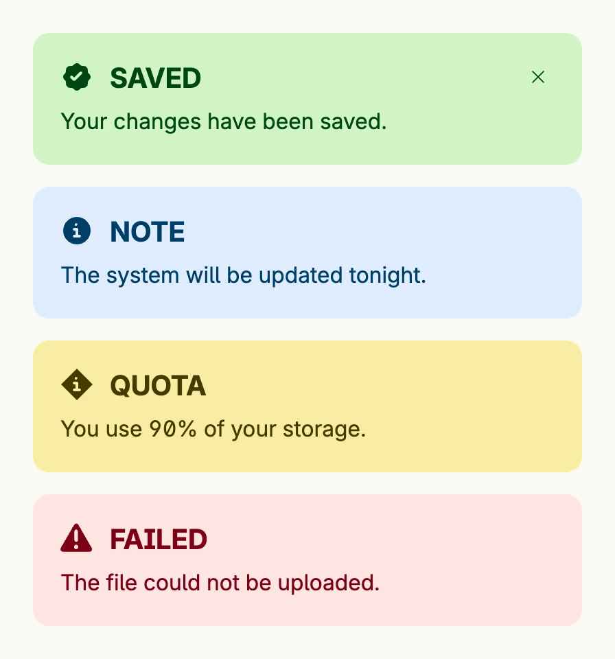

A banner shows a prominent message inside your view, e.g. a hint, a warning or the result of an action. The intent
sets the color and the icon. Bind it to a `*core.State[bool]` with `Closeable` to let the user dismiss it. To show
a short-lived message on top of the view instead, use [Banner Messages](../banner_messages/). All banner types live
in package `presentation/ui/alert`.



```go
presented := core.AutoState[bool](wnd).Init(func() bool { return true })

VStack(
	alert.Banner("Saved", "Your changes have been saved.").
		Intent(alert.IntentSuccess).
		Closeable(presented),
	alert.Banner("Note", "The system will be updated tonight.").
		Intent(alert.IntentOk),
	alert.Banner("Quota", "You use 90% of your storage.").
		Intent(alert.IntentWarning),
	alert.Banner("Failed", "The file could not be uploaded.").
		Intent(alert.IntentError),
).Gap(L16)
```

The intents are `IntentError` (the zero value and therefore the default), `IntentOk`, `IntentWarning` and
`IntentSuccess`.

## Constructors

| Constructor | Description |
|---|---|
| `func Banner(title, message string) TBanner` | Creates a banner with the given title and message. |

The package also has helpers which return banners: `alert.NotFound() core.View` shows a "not found" banner and sets
the window title, and `alert.IfPermissionDenied(wnd core.Window, oneOf ...permission.ID) core.View` returns a
banner if the user is not logged in or has none of the permissions, otherwise nil.

## Methods

| Method | Description |
|---|---|
| `AutoCloseTimeoutOrDefault(d time.Duration) TBanner` | Deprecated: will be removed because of accessibility concerns. |
| `Closeable(presented *core.State[bool]) TBanner` | Closeable makes the banner dismissible by binding its visibility to the given state. |
| `Frame(frame ui.Frame) TBanner` | Frame sets a custom frame (layout constraints) for the banner. |
| `ID(id string) TBanner` | ID sets an optional ID for the banner component. |
| `Intent(intent Intent) TBanner` | Intent sets the visual intent of the banner (e.g., success, warning, error). |
| `OnClosed(fn func()) TBanner` | OnClosed sets a callback function that is triggered when the banner is closed. |

## Related

- [Banner Messages](../banner_messages/)
- [Banner Error](../banner_error/)
- [Dialog](../dialog/)
- Tutorials: [Alert banner](/docs/examples/tutorial-109-alert-banner/)
