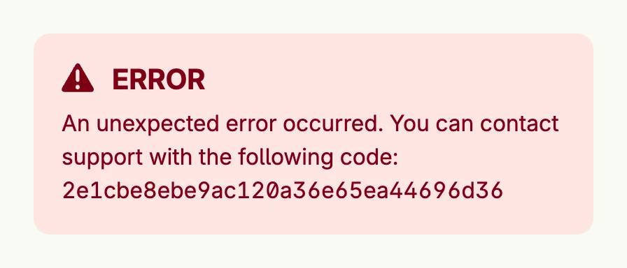

A banner error shows an error as a [Banner](../banner/) inside your view. Errors which package `application/xerror`
recognizes, e.g. a missing login, a denied permission, a missing element or a validation error, are shown with a localized, user-friendly text. For all other errors the user only
sees a generic text and a token, so that no confidential details leak; the error itself is logged with the same
token. It renders nothing if the error is nil, so you can place it unconditionally. To show the error as an overlay
instead, call `alert.ShowBannerError`, see [Banner Messages](../banner_messages/).



```go
err := fmt.Errorf("cannot connect to database: connection refused")

// the user only sees a generic message, the details go into the log
alert.BannerError(err)
```

## Constructors

| Constructor | Description |
|---|---|
| `func BannerError(err error) TBannerError` | BannerError wraps a given error into a TBannerError, which can later be rendered as a user-visible banner. |

## Methods

| Method | Description |
|---|---|

## Related

- [Banner](../banner/)
- [Banner Messages](../banner_messages/)
- [Error View](../error_view/)
