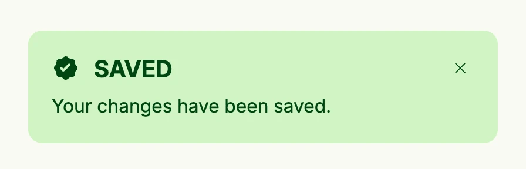

Banner messages are short-lived notifications which appear on top of the view, e.g. "Saved" after a click. Call
`alert.ShowBannerMessage` from anywhere, e.g. an action or a use case callback, and place `alert.BannerMessages`
in your view tree to render all pending messages as an overlay at the top right. The user closes them one by one
or all at once. The scaffold of the configurator already includes `BannerMessages`, so you only need to add it
to views without the scaffold.



```go
VStack(
	PrimaryButton(func() {
		alert.ShowBannerMessage(wnd, alert.Message{
			Title:   "Saved",
			Message: "Your changes have been saved.",
			Intent:  alert.IntentSuccess,
		})
	}).Title("Save"),

	// renders all pending messages as an overlay
	alert.BannerMessages(wnd),
)
```

## Constructors

| Constructor | Description |
|---|---|
| `func BannerMessages(wnd core.Window) TBannerMessages` | Creates the overlay which renders the pending messages of the window; it renders nothing if there are none. |
| `func ShowBannerMessage(wnd core.Window, msg Message)` | Adds the message to the pending messages of the window. It is thread safe. |
| `func ShowBannerError(wnd core.Window, err error)` | Like `ShowBannerMessage`, but for unexpected errors: the user only sees a generic text and a token which you find in the log. |

`alert.Message` has the fields `Title`, `Message`, `Intent` and `Duration`; `Duration` is currently ignored and
messages stay until the user closes them. Identical messages are only shown once.

## Methods

| Method | Description |
|---|---|

## Related

- [Banner](../banner/)
- [Banner Error](../banner_error/)
- [Modal](../modal/)
- Tutorials: [Dialogs and alerts](/docs/examples/tutorial-110-dialog-and-alerts/), [Upload file](/docs/examples/tutorial-20-upload-file/)
