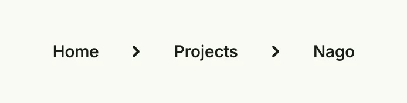

Breadcrumbs show the path of the user to the current page as a row of links separated by chevrons, e.g.
"Home › Projects › Nago". Use them in nested navigation so that the user can jump back to a parent page. They live in
package `presentation/ui/breadcrumb`. `Item` appends a tertiary button; you can also pass any views to the
constructor.



```go
breadcrumb.Breadcrumbs().
	ClampLeading().
	Item("Home", func() { wnd.Navigation().ForwardTo("/", nil) }).
	Item("Projects", func() {}).
	Item("Nago", func() {})
```

## Constructors

| Constructor | Description |
|---|---|
| `func Breadcrumbs(items ...core.View) TBreadcrumbs` | Breadcrumbs creates a new breadcrumb trail with the given items. |

## Methods

| Method | Description |
|---|---|
| `ClampLeading() TBreadcrumbs` | ClampLeading ensures that if the first entry is a default Item its title will be aligned to the leading of this component so that you can align the optical flight of text. |
| `Frame(frame ui.Frame) TBreadcrumbs` | Frame defines the frame layout (size and positioning) of the breadcrumbs. |
| `Gap(l ui.Length) TBreadcrumbs` | Gap sets the spacing between breadcrumb items. |
| `Item(title string, action func()) TBreadcrumbs` | Item appends a default button with the given title and text. |
| `Padding(padding ui.Padding) TBreadcrumbs` | Padding sets the inner padding around the breadcrumb trail. |

## Related

- [Button](../../basic/button/)
- Tutorials: [Line chart](/docs/examples/tutorial-66-line-chart/)
