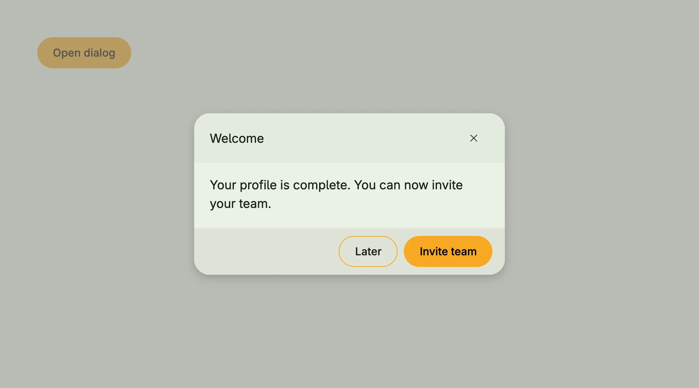

`ui.Dialog` is the plain dialog box with a title, a body and a footer, which [Dialog](../dialog/) uses internally.
Use it when the options of `alert.Dialog` are not enough, e.g. for a custom footer layout. It does not block the
background on its own: wrap it into a [Modal](../modal/) and show it conditionally with `If`. Close it in
`OnDismissRequest`, which is called when the user dismisses the modal, e.g. by pressing Escape.



```go
presented := core.AutoState[bool](wnd)
closeDlg := func() { presented.Set(false) }

VStack(
	If(presented.Get(), Modal(
		Dialog(Text("Your profile is complete. You can now invite your team.")).
			Title(Text("Welcome")).
			TitleX(TertiaryButton(closeDlg).PreIcon(icons.XMark)).
			Footer(HStack(
				SecondaryButton(closeDlg).Title("Later"),
				PrimaryButton(closeDlg).Title("Invite team"),
			).Gap(L8)),
	).OnDismissRequest(closeDlg)),
	PrimaryButton(func() { presented.Set(true) }).Title("Open dialog"),
)
```

## Constructors

| Constructor | Description |
|---|---|
| `func Dialog(body core.View) TDialog` | Creates a dialog with the given body, 400dp wide and at most the viewport height minus 12rem. |

## Methods

| Method | Description |
|---|---|
| `Alignment(alignment Alignment) TDialog` | Alignment sets the alignment of the dialog content. |
| `DisableBoxLayout(b bool) TDialog` | DisableBoxLayout disables box layout handling for the dialog when set to true. |
| `Footer(footer core.View) TDialog` | Footer sets the footer view of the dialog, typically used for action buttons. |
| `Frame(frame Frame) TDialog` | Frame sets the layout frame of the dialog, including size and positioning. |
| `ModalPadding(padding Padding) TDialog` | ModalPadding sets the padding around the dialog content. |
| `PreBody(v core.View) TDialog` | PreBody sets an optional view that will be rendered before the main body. |
| `Title(title core.View) TDialog` | Title sets the title view of the dialog, displayed at the top. |
| `TitleX(x core.View) TDialog` | TitleX sets an additional title view, often used for actions or secondary title elements aligned differently from the main title. |
| `WithFrame(fn func(Frame) Frame) TDialog` | WithFrame applies a transformation function to the dialog's frame and returns the updated component. |

## Related

- [Dialog](../dialog/)
- [Modal](../modal/)
- Tutorials: [Dialog](/docs/examples/tutorial-07-dialog/), [Dialogs and alerts](/docs/examples/tutorial-110-dialog-and-alerts/)
