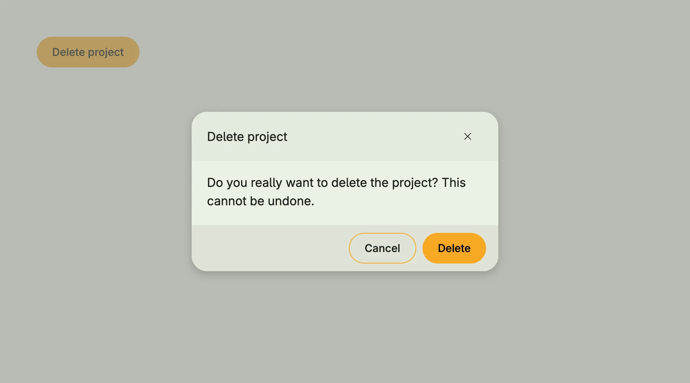

A dialog shows content in a modal window above the view, e.g. to confirm a destructive action or to edit a few
values. `alert.Dialog` from package `presentation/ui/alert` is the preferred way: it renders only while its
`*core.State[bool]` is true, and options add the usual buttons, which close the dialog by setting the state to
false. If you need full control over the layout, compose a [Custom Dialog](../custom_dialog/) instead.



```go
presented := core.AutoState[bool](wnd)

VStack(
	alert.Dialog(
		"Delete project",
		Text("Do you really want to delete the project? This cannot be undone."),
		presented,
		alert.Closeable(),
		alert.Cancel(nil),
		alert.Delete(func() {
			// delete the project
		}),
	),
	PrimaryButton(func() { presented.Set(true) }).Title("Delete project"),
)
```

## Constructors

| Constructor | Description |
|---|---|
| `func Dialog(title string, body core.View, isPresented *core.State[bool], opts ...Option) TDialog` | Creates a dialog with the given title, body, visibility state and options. |

### Options

Buttons are always placed in the order ok, cancel, delete, save, custom. The save-like options take a callback
which returns whether the dialog closes.

| Option | Description |
|---|---|
| `Ok() Option` | Ok adds a default button that closes the dialog. |
| `Cancel(onCancel func()) Option` | Adds a cancel button and closes the dialog on Escape. |
| `Back(onCancel func()) Option` | Back adds a button that closes the dialog and triggers the given callback. |
| `Delete(onDelete func()) Option` | Delete adds a button that closes the dialog and triggers the given callback. |
| `Save(onSave func() (close bool)) Option` | Save adds a button that triggers the callback and optionally closes the dialog. |
| `Create(onSave func() (close bool)) Option` | Like `Save`, with the caption "Create". |
| `Add(onSave func() (close bool)) Option` | Like `Save`, with the caption "Add". |
| `Apply(onSave func() (close bool)) Option` | Like `Save`, with the caption "Apply". |
| `Close(onSave func() (close bool)) Option` | Like `Save`, with the caption "Close". |
| `Confirm(onSave func() (close bool)) Option` | Like `Save`, with the caption "Confirm". |
| `Custom(makeCustomView func(close func(closeDlg bool)) core.View) Option` | Custom adds a custom footer (button) element. |
| `Closeable() Option` | Adds a close icon button and closes the dialog on Escape. |
| `Alignment(alignment ui.Alignment) Option` | Alignment sets the alignment of the dialog content. |
| `ModalPadding(padding ui.Padding) Option` | ModalPadding defines the padding inside the modal dialog. |
| `PreBody(v core.View) Option` | PreBody sets a view between title and body. |
| `Width(w ui.Length) Option` | Width sets the dialog width to the given Length. |
| `MinWidth(w ui.Length) Option` | MinWidth is probably not what you want. |
| `Large() Option` | Large sets the dialog width to 560dp (35rem). |
| `Larger() Option` | Larger sets the dialog width to 880dp (55rem). |
| `XLarge() Option` | XLarge sets the dialog width to 1200dp (75rem). |
| `XXLarge() Option` | XXLarge sets the dialog width to 1600dp (100rem). |
| `Height(h ui.Length) Option` | Height sets the dialog height to the given Length. |
| `FullHeight() Option` | FullHeight makes the dialog take the full available height. |

## Methods

| Method | Description |
|---|---|

## Related

- [Custom Dialog](../custom_dialog/) and [Modal](../modal/)
- [Dialog Create](../dialog_create/) and [Dialog Edit](../dialog_edit/) for forms
- [Banner](../banner/)
- Tutorials: [Text field](/docs/examples/tutorial-12-textfield/), [Toggle](/docs/examples/tutorial-13-toggle/), [Checkbox](/docs/examples/tutorial-14-checkbox/)
