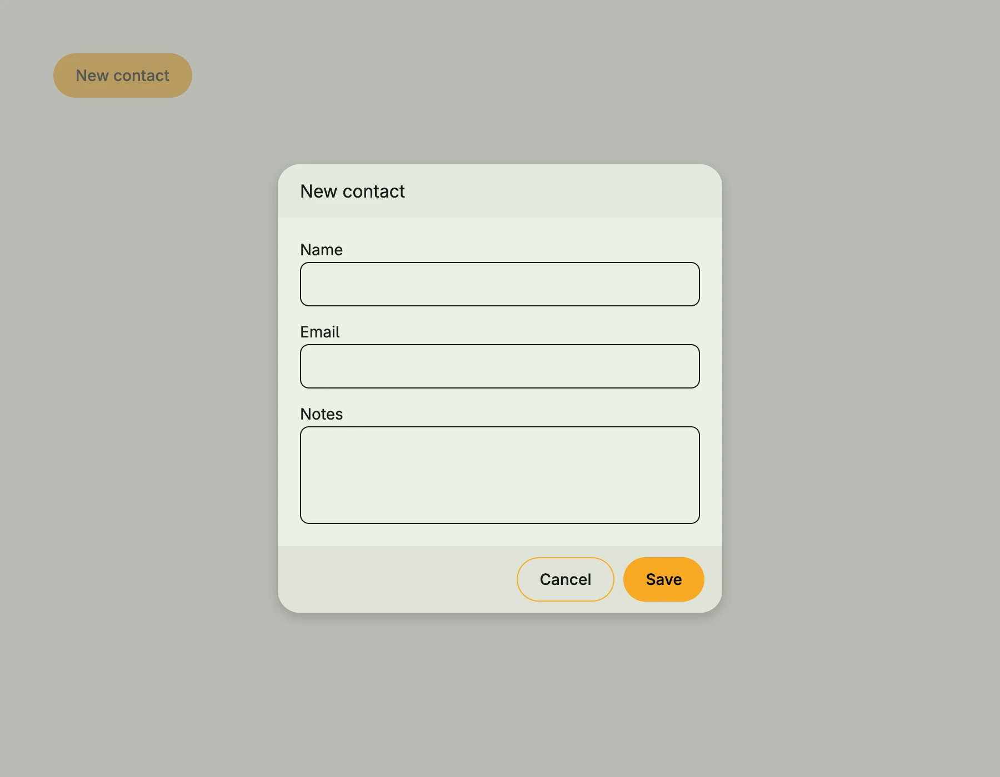

`form.DialogCreate` is a [Dialog](../dialog/) with a form to create a new value of type `T`. The form is generated
from the struct fields of `T` with `form.Auto`, so struct tags like `label` or `lines` apply. On save, it calls your
callback with the current subject and the entered value; if the callback returns an error, the dialog stays open
and the error is shown with `alert.ShowBannerError`. The entered value is kept in a window state named after the
dialog.



```go
type Contact struct {
	Name  string `label:"Name"`
	Email string `label:"Email"`
	Notes string `label:"Notes" lines:"3"`
}

presented := core.AutoState[bool](wnd)

VStack(
	form.DialogCreate(wnd, "New contact", presented, func(subject auth.Subject, c Contact) error {
		// store the contact
		return nil
	}),
	PrimaryButton(func() { presented.Set(true) }).Title("New contact"),
)
```

## Constructors

| Constructor | Description |
|---|---|
| `func DialogCreate[T any](wnd core.Window, name string, presented *core.State[bool], onCreate func(subject auth.Subject, value T) error) TDialogCreate[T]` | Creates a create dialog with the given title, visibility state and create callback. |

## Methods

| Method | Description |
|---|---|

## Related

- [Dialog Edit](../dialog_edit/)
- [Dialog](../dialog/)
- [Auto Form](/docs/components/composite/auto_form/)
- Tutorials: [Auto form](/docs/examples/tutorial-48-form-auto/)
