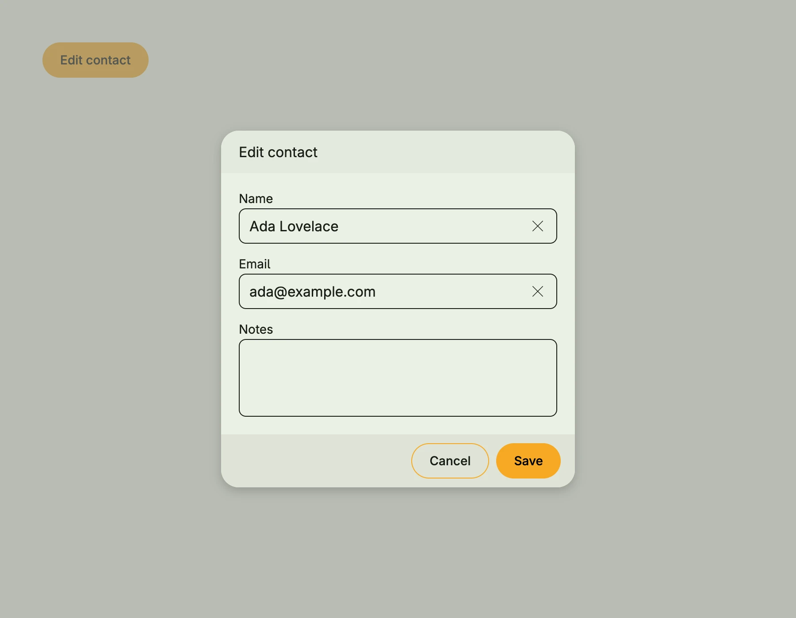

`form.DialogEdit` is a [Dialog](../dialog/) with a form to edit an existing value of type `T`. The form is generated
from the struct fields of `T` with `form.Auto` and writes directly into the given model state. On save, it calls your
callback, which reads the state and stores it; if the callback returns an error, the dialog stays open and the
error is shown with `alert.ShowBannerError`.



```go
presented := core.AutoState[bool](wnd)
contact := core.AutoState[Contact](wnd).Init(func() Contact {
	return Contact{Name: "Ada Lovelace", Email: "ada@example.com"}
})

VStack(
	form.DialogEdit(wnd, "Edit contact", presented, contact, func(subject auth.Subject) error {
		// store contact.Get()
		return nil
	}),
	PrimaryButton(func() { presented.Set(true) }).Title("Edit contact"),
)
```

`Contact` is the struct from [Dialog Create](../dialog_create/).


The form edits the model state directly, so "Cancel" closes the dialog but keeps the changes in the state. Reload
the value when you open the dialog if you need to discard them.


## Constructors

| Constructor | Description |
|---|---|
| `func DialogEdit[T any](wnd core.Window, name string, presented *core.State[bool], modelState *core.State[T], onSave func(subject auth.Subject) error) TDialogEdit[T]` | Creates an edit dialog with the given title, visibility state, model state and save callback. |

## Methods

| Method | Description |
|---|---|

## Related

- [Dialog Create](../dialog_create/)
- [Dialog](../dialog/)
- [Auto Form](/docs/components/composite/auto_form/)
- Tutorials: [Auto form](/docs/examples/tutorial-48-form-auto/)
