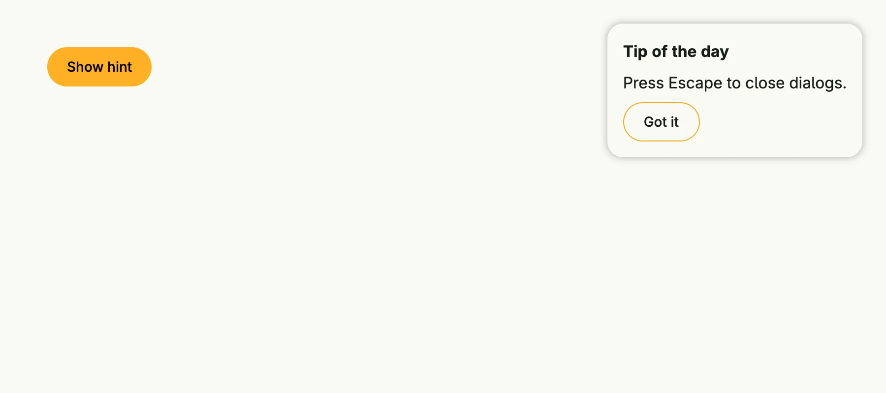

A modal places its content in a layer above the view. `Modal` centers the content and blocks the background, it is
the base of all dialogs. `Overlay` positions the content absolutely with `Top`, `Left`, `Right` and `Bottom` and
keeps the background usable, e.g. for popovers or hints. `NotificationsOverlay` is an overlay which stays in front
of other overlays, see [Banner Messages](../banner_messages/). Show a modal conditionally with `If`.



```go
presented := core.AutoState[bool](wnd)

VStack(
	PrimaryButton(func() { presented.Set(true) }).Title("Show hint"),
	If(presented.Get(), Overlay(
		VStack(
			Text("Tip of the day").Font(SubTitle),
			Text("Press Escape to close dialogs."),
			SecondaryButton(func() { presented.Set(false) }).Title("Got it"),
		).Alignment(Leading).
			Gap(L8).
			BackgroundColor(M1).
			Border(Border{}.Radius(L16).Shadow(L8)).
			Padding(Padding{}.All(L16)),
	).Top(L24).Right(L24)),
)
```

## Constructors

| Constructor | Description |
|---|---|
| `func Modal(content core.View) TModal` | Modal places the content and blocks the background controls. |
| `func Overlay(content core.View) TModal` | Places the content at absolute positions without blocking the background. |
| `func NotificationsOverlay(content core.View) TModal` | Like `Overlay`, but positioned in front of other overlays. |

## Methods

| Method | Description |
|---|---|
| `AllowBackgroundScrolling(allowBackgroundScrolling bool) TModal` | AllowBackgroundScrolling configures whether background content can scroll while the modal is open. |
| `Bottom(bottom Length) TModal` | Bottom sets the bottom offset of the modal. |
| `Left(left Length) TModal` | Left sets the left offset of the modal. |
| `OnDismissRequest(fn func()) TModal` | OnDismissRequest sets an event handler for the dismiss event. |
| `Right(right Length) TModal` | Right sets the right offset of the modal. |
| `Top(top Length) TModal` | Top sets the top offset of the modal. |

## Related

- [Custom Dialog](../custom_dialog/)
- [Dialog](../dialog/)
- Tutorials: [Dialog](/docs/examples/tutorial-07-dialog/), [Dialogs and alerts](/docs/examples/tutorial-110-dialog-and-alerts/)
