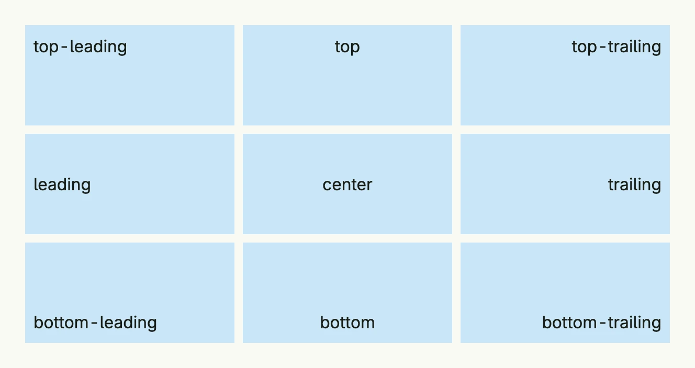

`Alignment` positions the children of a container: one of the four edges, one of the four corners or the center.
Stacks, boxes, grid cells, table cells and many other components accept it. The zero value is `Center`.



```go
alignments := []Alignment{
	TopLeading, Top, TopTrailing,
	Leading, Center, Trailing,
	BottomLeading, Bottom, BottomTrailing,
}

return Grid(
	ForEach(alignments, func(a Alignment) TGridCell {
		return GridCell(
			VStack(Text(a.String())).
				Alignment(a).
				BackgroundColor("#C9E7F8").
				Padding(Padding{}.All(L8)).
				Frame(Frame{}.Size(L200, L96)),
		)
	})...,
).Columns(3).Gap(L8)
```

`Stretch` is an additional value which lets the content fill the available space, e.g. in a
[GridCell](../grid_cell/). In a [VStack](../vstack/) the alignment also places the children horizontally: `Leading`
aligns them on the left edge, in an [HStack](../hstack/) `Top` aligns them on the top edge.

## Constructors

`Alignment` is an enum. Use the constants `Center`, `Top`, `Bottom`, `Leading`, `Trailing`, `TopLeading`,
`TopTrailing`, `BottomLeading`, `BottomTrailing` and `Stretch`.

| Function | Description |
|----------|-------------|
| `Alignments() []Alignment` | Returns all alignments except `Stretch`. |

## Methods

| Method | Description |
|--------|-------------|
| `String() string` | Returns a readable name like `top-leading`. |

## Related

- [Box](../box/), [VStack](../vstack/), [HStack](../hstack/), [Grid Cell](../grid_cell/)
- Tutorials: [Combining views](/docs/examples/tutorial-02-combining-views/), [Box](/docs/examples/tutorial-03-box/),
  [Stretch](/docs/examples/tutorial-44-stretch/)
