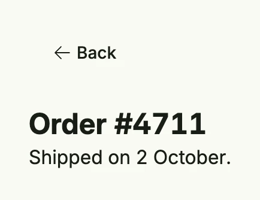

`layout.WithBackButton` of package [`layout`](https://github.com/worldiety/nago/tree/main/presentation/ui/layout)
puts a localized back button above a view. The button navigates back in the browser history. Use it for detail
pages which are reached from a list.



```go
return VStack(
	layout.WithBackButton(wnd, VStack(
		Text("Order #4711").Font(HeadlineSmall),
		Text("Shipped on 2 October."),
	).Alignment(Leading).FullWidth()),
).Frame(Frame{Width: L480})
```

## Constructors

| Function | Description |
|----------|-------------|
| `layout.WithBackButton(wnd core.Window, view core.View) core.View` | Wraps a view with a back button at the top. |

The result is a full-width [VStack](../vstack/); there are no methods to configure it further.

## Related

- [VStack](../vstack/), [Button](../../basic/button/)
