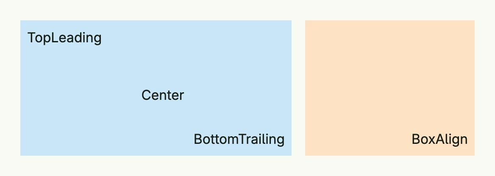

A box places up to nine children at fixed positions: the four corners, the four edges and the center. Children may
overlap, which makes the box useful for badges, captions on images or controls on top of other content. A box
clips its children and does not size itself by its content, so give it an explicit width and height.



```go
return HStack(
	Box(BoxLayout{
		TopLeading:     Text("TopLeading"),
		Center:         Text("Center"),
		BottomTrailing: Text("BottomTrailing"),
	}).BackgroundColor("#C9E7F8").
		Padding(Padding{}.All(L8)).
		Frame(Frame{}.Size(L320, L160)),

	BoxAlign(BottomTrailing, Text("BoxAlign")).
		BackgroundColor("#FDE2C4").
		Padding(Padding{}.All(L8)).
		Frame(Frame{}.Size(L200, L160)),
).Gap(L16)
```

## Constructors

| Constructor | Description |
|-------------|-------------|
| `Box(layout BoxLayout) TBox` | Creates a box from a `BoxLayout`, whose fields `Top`, `Center`, `Bottom`, `Leading`, `Trailing`, `TopLeading`, `TopTrailing`, `BottomLeading` and `BottomTrailing` take the child for that position. |
| `BoxAlign(alignment Alignment, child core.View) TBox` | Creates a box with a single child at the given [alignment](../alignment/). |

## Methods

| Method | Description |
|--------|-------------|
| `AccessibilityLabel(label string) DecoredView` | Sets a label used by screen readers for accessibility. |
| `BackgroundColor(backgroundColor Color) DecoredView` | Sets the background color of the box. |
| `Border(border Border) DecoredView` | Sets the border styling of the box. |
| `DisableOutsidePointerEvents(disable bool) TBox` | Controls whether pointer events are disabled outside the box's content. |
| `Font(font Font) DecoredView` | Sets the font style for text content inside the box. |
| `Frame(fr Frame) DecoredView` | Sets the layout frame of the box, including size and positioning. |
| `FullWidth() TBox` | Sets the box to span the full available width. |
| `Padding(p Padding) DecoredView` | Sets the inner spacing around the box's children. |
| `Visible(visible bool) DecoredView` | Controls the visibility of the box; setting false hides it. |
| `WithFrame(fn func(Frame) Frame) DecoredView` | Applies a transformation function to the box's frame and returns the updated component. |

## Related

- [Alignment](../alignment/), [Frame](../frame/), [Position](../position/), [Grid](../grid/)
- Tutorials: [Box](/docs/examples/tutorial-03-box/), [Container](/docs/examples/tutorial-04-container/),
  [Gantt grid](/docs/examples/tutorial-05-gantt-grid/)
