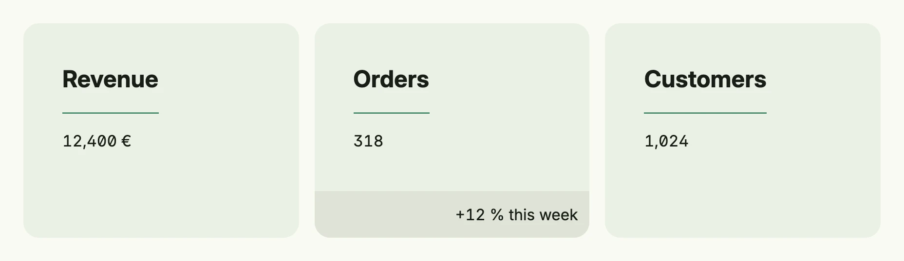

The card layout of package [`cardlayout`](https://github.com/worldiety/nago/tree/main/presentation/ui/cardlayout)
arranges views, typically cards, in a responsive grid. By default it uses one column on small and medium windows,
two on large windows and three on wider ones; override this per window size class with `Columns`.



```go
return cardlayout.Layout(
	cardlayout.Card("Revenue").Body(Text("12,400 €")),
	cardlayout.Card("Orders").Body(Text("318")).Footer(Text("+12 % this week")),
	cardlayout.Card("Customers").Body(Text("1,024")),
).Columns(core.SizeClassLarge, 3).
	Frame(Frame{Width: L880})
```

## Constructors

| Constructor | Description |
|-------------|-------------|
| `cardlayout.Layout(children ...core.View) TCardLayout` | Creates a card layout with the given children; nil children are skipped. |

The package also provides `cardlayout.Card(title string) TCard`, a card with title, body and optional footer.

## Methods

| Method | Description |
|--------|-------------|
| `Columns(class core.WindowSizeClass, columns int) TCardLayout` | Sets a custom number of columns for a specific window size class. |
| `Frame(frame ui.Frame) TCardLayout` | Sets the frame (size and positioning) for the card layout. |
| `Padding(padding ui.Padding) TCardLayout` | Sets the inner spacing for the card layout. |

## Related

- [Card](../../basic/card/), [Grid](../grid/), [View That Matches](../../utility/view_that_matches/)
