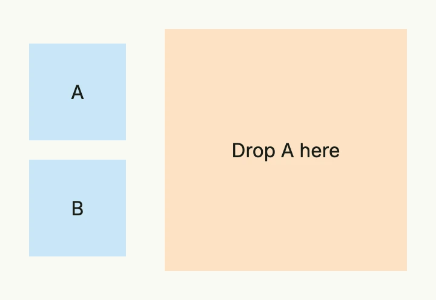

A drag and drop area wraps views which the user can drag, or onto which the user can drop other areas. Give
every area an `ID`. A drop target lists the IDs it accepts with `Droppable`; when one of them is dropped, its ID
is written into the state bound with `InputValue`. Moving the dropped view is up to you: change your model in
an `Observe` of that state and render again.



```go
dropped := core.AutoState[string](wnd).Observe(func(id string) {
	// the area with this id was dropped onto the zone
})

item := func(id, label string) core.View {
	return DnDArea(
		VStack(Text(label)).BackgroundColor("#C9E7F8").Frame(Frame{}.Size(L80, L80)),
	).ID(id).CanDrag(true)
}

return HStack(
	VStack(item("a", "A"), item("b", "B")).Gap(L16),
	DnDArea(
		VStack(Text("Drop A here")).BackgroundColor("#FDE2C4").Frame(Frame{}.Size(L200, L200)),
	).ID("zone").
		CanDrop(true).
		Droppable("a").
		InputValue(dropped),
).Gap(L32)
```

## Constructors

| Constructor | Description |
|-------------|-------------|
| `func DnDArea(children ...core.View) TDnDArea` | Creates an area which contains the given views. |

## Methods

| Method | Description |
|--------|-------------|
| `CanDrag(canDrag bool) TDnDArea` | Allows the user to drag the area. |
| `CanDrop(canDrop bool) TDnDArea` | Allows the user to drop other areas onto this area. |
| `Droppable(ids ...string) TDnDArea` | Sets the IDs of the areas which may be dropped onto this area. |
| `Frame(frame Frame) TDnDArea` | Sets the frame of the area. |
| `ID(id string) TDnDArea` | Sets the ID which identifies the area when it is dropped. |
| `InputValue(state *core.State[string]) TDnDArea` | Binds a state which receives the ID of the area dropped onto this area. |

## Related

- [VStack](../vstack/), [Box](../box/)
- Tutorials: [Drag and drop](/docs/examples/tutorial-80-drag-and-drop/)
