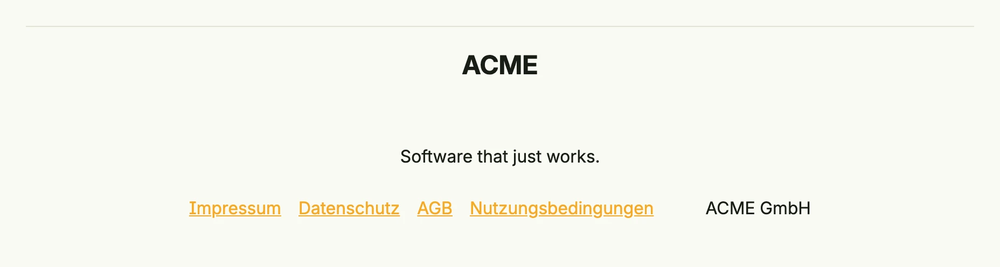

The footer of package [`footer`](https://github.com/worldiety/nago/tree/main/presentation/ui/footer) closes a page
with a separator line, a logo, a slogan, the legal links and the provider name. It stacks its parts vertically on
small windows and places the links in a row on larger ones. The scaffold builder of the configurator can create
it automatically from the theme settings, or you pass your own footer to `ScaffoldBuilder.Footer`.



```go
return VStack(
	footer.Footer().
		Logo(Text("ACME").Font(HeadlineSmall)).
		Slogan("Software that just works.").
		Impress("/impress").
		PrivacyPolicy("/privacy").
		GeneralTermsAndConditions("/gtc").
		TermsOfUse("/terms").
		ProviderName("ACME GmbH"),
).Frame(Frame{Width: L880})
```


The link labels (Impressum, Datenschutz, AGB, Nutzungsbedingungen) are currently fixed German texts.


## Constructors

| Constructor | Description |
|-------------|-------------|
| `footer.Footer() TFooter` | Creates a footer with the default content padding. |

## Methods

| Method | Description |
|--------|-------------|
| `BackgroundColor(backgroundColor ui.Color) TFooter` | Sets the background color of the footer. |
| `ContentPadding(content ui.Length) TFooter` | Sets the space between the footer separator and the view before the footer; `""` disables it. |
| `GeneralTermsAndConditions(gtc LinkOrNavigationPath) TFooter` | Sets the GTC link of the footer. |
| `Impress(impress LinkOrNavigationPath) TFooter` | Sets the imprint link of the footer. |
| `Logo(logo ui.DecoredView) TFooter` | Sets the logo view of the footer. |
| `PrivacyPolicy(gdpr LinkOrNavigationPath) TFooter` | Sets the privacy policy (GDPR) link of the footer. |
| `ProviderName(copyright string) TFooter` | Sets the copyright/provider name of the footer. |
| `Slogan(slogan string) TFooter` | Sets the slogan text of the footer. |
| `TermsOfUse(termsOfUse LinkOrNavigationPath) TFooter` | Sets the terms of use link of the footer. |
| `TextColor(textColor ui.Color) TFooter` | Sets the text color of the footer. |

`LinkOrNavigationPath` is a string with either a URL or a navigation path of your application.

## Related

- [Scaffold](../../composite/scaffold/), [Divider](../../utility/divider/)
- Tutorials: [Scaffold](/docs/examples/tutorial-17-scaffold/)
