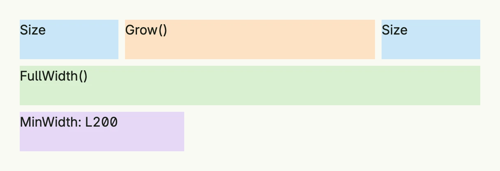

A `Frame` sets the size constraints of a component: fixed width and height, minimum and maximum sizes, and how it
behaves inside a flex stack. All fields are optional; a zero field does not constrain the layout. Most components
take a frame through their `Frame` method, many also offer `FullWidth()` as a shortcut.



```go
return VStack(
	HStack(
		Text("Size").BackgroundColor("#C9E7F8").Frame(Frame{}.Size(L120, L48)),
		Text("Grow()").BackgroundColor("#FDE2C4").Frame(Frame{Height: L48}.Grow()),
		Text("Size").BackgroundColor("#C9E7F8").Frame(Frame{}.Size(L120, L48)),
	).Gap(L8).FullWidth(),
	Text("FullWidth()").BackgroundColor("#D8F0D2").Frame(Frame{Height: L48}.FullWidth()),
	Text("MinWidth: L200").BackgroundColor("#E5D8F6").Frame(Frame{MinWidth: L200, Height: L48}),
).Gap(L8).
	Alignment(Leading).
	Frame(Frame{Width: L560})
```

## Fields

| Field | Description |
|-------|-------------|
| `Width`, `Height` | Fixed size as a [Length](../../utility/length/). |
| `MinWidth`, `MaxWidth`, `MinHeight`, `MaxHeight` | Lower and upper bounds. |
| `FlexGrow` | Grow inside the available space of a stack, see `Grow`. |
| `FlexPreventShrink` | Do not shrink inside a stack, see `PreventShrink`. |

## Methods

| Method | Description |
|--------|-------------|
| `FullHeight() Frame` | Sets the frame's height to 100% of the available space. |
| `FullWidth() Frame` | Sets the frame's width to 100% of the available space. |
| `Grow() Frame` | Tells the frame to grow inside the available space of a flex stack. |
| `IsZero() bool` | Returns true if all fields of the Frame are unset (zero value). |
| `Large() Frame` | Sets the max width to 560dp (35rem) and Width to Full. |
| `Larger() Frame` | Sets the width to 880dp (55rem) and Width to Full. |
| `MatchScreen() Frame` | Sets the frame to match the full viewport height and width. |
| `PreventShrink() Frame` | Tells the frame to not shrink inside a flex stack. |
| `Size(w, h Length) Frame` | Sets both Width and Height to the given values and returns the updated Frame. |


Relative sizes like `FullWidth()` or `Full` only take effect if the parent has a size itself. A stack wraps its
content by default, so a child with full width needs a parent with full width too.


## Related

- [Length](../../utility/length/), [Padding](../../utility/padding/), [Spacer](../spacer/), [Box](../box/)
- Tutorials: [Hello World](/docs/examples/tutorial-01-helloworld/),
  [Combining views](/docs/examples/tutorial-02-combining-views/), [Stretch](/docs/examples/tutorial-44-stretch/)
