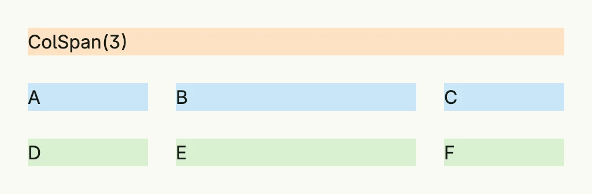

A grid arranges [grid cells](../grid_cell/) in rows and columns. For simple cases set the number of columns and add
the cells in reading order; cells can span several columns or rows. For overlapping or sparse layouts, set rows,
columns and the start and end positions of each cell explicitly.



```go
return Grid(
	GridCell(Text("ColSpan(3)")).ColSpan(3).BackgroundColor("#FDE2C4").Padding(Padding{}.All(L8)),
	GridCell(Text("A")).BackgroundColor("#C9E7F8").Padding(Padding{}.All(L8)),
	GridCell(Text("B")).BackgroundColor("#C9E7F8").Padding(Padding{}.All(L8)),
	GridCell(Text("C")).BackgroundColor("#C9E7F8").Padding(Padding{}.All(L8)),
	GridCell(Text("D")).BackgroundColor("#D8F0D2").Padding(Padding{}.All(L8)),
	GridCell(Text("E")).BackgroundColor("#D8F0D2").Padding(Padding{}.All(L8)),
	GridCell(Text("F")).BackgroundColor("#D8F0D2").Padding(Padding{}.All(L8)),
).Columns(3).
	Gap(L8).
	Widths(L120, "1fr", L120).
	Frame(Frame{Width: L480})
```

`Widths` and `Heights` take any [Length](../../utility/length/); the CSS fraction unit `fr` distributes the
remaining space.

## Constructors

| Constructor | Description |
|-------------|-------------|
| `Grid(cells ...TGridCell) TGrid` | Creates a new grid containing the given cells. |

## Methods

| Method | Description |
|--------|-------------|
| `AccessibilityLabel(label string) DecoredView` | Sets the accessibility label of the grid, used by screen readers. |
| `Append(cells ...TGridCell) TGrid` | Adds one or more cells to the grid. |
| `BackgroundColor(backgroundColor Color) DecoredView` | Sets the background color of the grid. |
| `Border(border Border) DecoredView` | Sets the border styling of the grid. |
| `ColGap(g Length) TGrid` | Sets the horizontal spacing between columns in the grid. |
| `Columns(cols int) TGrid` | Sets the amount of columns explicitly. |
| `Font(font Font) DecoredView` | Sets the font style applied to text inside the grid. |
| `Frame(fr Frame) DecoredView` | Sets the layout frame of the grid, including size and positioning. |
| `FullWidth() TGrid` | Sets the grid to span the full available width. |
| `Gap(g Length) TGrid` | Sets RowGap and ColGap equally. |
| `Heights(rowHeights ...Length) TGrid` | Sets optional row heights from top to bottom. |
| `Padding(padding Padding) DecoredView` | Sets the inner spacing around the grid. |
| `RowGap(g Length) TGrid` | Sets the vertical spacing between rows in the grid. |
| `Rows(rows int) TGrid` | Sets the amount of rows explicitly. |
| `Visible(visible bool) DecoredView` | Controls the visibility of the grid; setting false hides it. |
| `Widths(colWidths ...Length) TGrid` | Sets optional column widths from left to right; undefined widths share the remaining space. |
| `WithFrame(fn func(Frame) Frame) DecoredView` | Applies a transformation function to the grid's frame and returns the updated component. |

## Related

- [Grid Cell](../grid_cell/), [Card Layout](../card_layout/), [Table](../../composite/table/)
- Tutorials: [Gantt grid](/docs/examples/tutorial-05-gantt-grid/), [Responsive](/docs/examples/tutorial-06-responsive/),
  [Grid](/docs/examples/tutorial-30-grid/)
