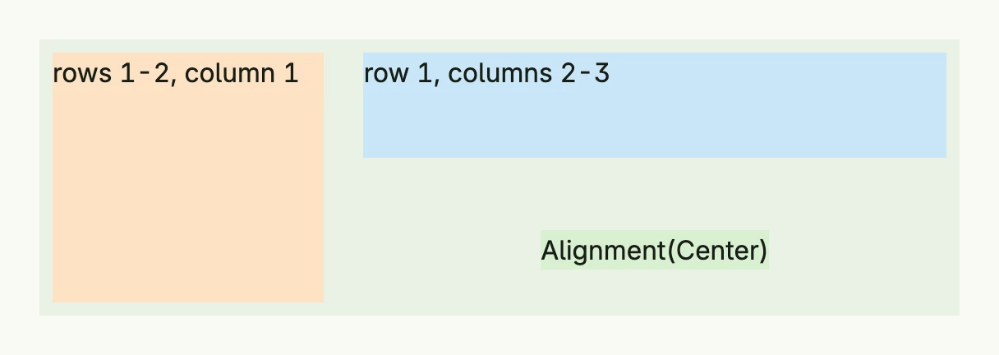

A grid cell wraps one view inside a [Grid](../grid/) and defines where it is placed and how it is styled. Rows and
columns start at 1, and an end position is exclusive: a cell from `ColStart(2)` to `ColEnd(4)` covers columns 2
and 3. By default the content stretches over the whole cell; with another alignment the content wraps its size and
the grid background shows around it.



```go
return Grid(
	GridCell(Text("rows 1-2, column 1")).
		RowStart(1).RowEnd(3).ColStart(1).ColEnd(2).
		BackgroundColor("#FDE2C4").Padding(Padding{}.All(L8)),
	GridCell(Text("row 1, columns 2-3")).
		RowStart(1).RowEnd(2).ColStart(2).ColEnd(4).
		BackgroundColor("#C9E7F8").Padding(Padding{}.All(L8)),
	GridCell(Text("Alignment(Center)")).
		RowStart(2).RowEnd(3).ColStart(2).ColEnd(4).
		Alignment(Center).
		BackgroundColor("#D8F0D2").Padding(Padding{}.All(L8)),
).Rows(2).
	Columns(3).
	Gap(L8).
	Heights(L80, L80).
	BackgroundColor(ColorCardBody).
	Frame(Frame{Width: L560})
```

## Constructors

| Constructor | Description |
|-------------|-------------|
| `GridCell(body core.View) TGridCell` | Creates a new grid cell containing the given body view. |

## Methods

| Method | Description |
|--------|-------------|
| `Alignment(a Alignment) TGridCell` | Sets the alignment of the content within the grid cell. |
| `BackgroundColor(color Color) TGridCell` | Sets the background color of the grid cell. |
| `ColEnd(colEnd int) TGridCell` | Sets the exclusive end column; it must be at least ColStart+1. |
| `ColSpan(colSpan int) TGridCell` | Spans the given number of columns; convenient, but may behave unexpectedly when cells overlap. |
| `ColStart(colStart int) TGridCell` | Sets the start column, starting at 1. |
| `Padding(p Padding) TGridCell` | Sets the inner spacing around the cell content. |
| `RowEnd(rowEnd int) TGridCell` | Sets the exclusive end row; it must be at least RowStart+1. |
| `RowSpan(rowSpan int) TGridCell` | Spans the given number of rows; convenient, but may behave unexpectedly when cells overlap. |
| `RowStart(rowStart int) TGridCell` | Sets the start row, starting at 1. |

## Related

- [Grid](../grid/), [Alignment](../alignment/), [Padding](../../utility/padding/)
- Tutorials: [Gantt grid](/docs/examples/tutorial-05-gantt-grid/), [Grid](/docs/examples/tutorial-30-grid/)
