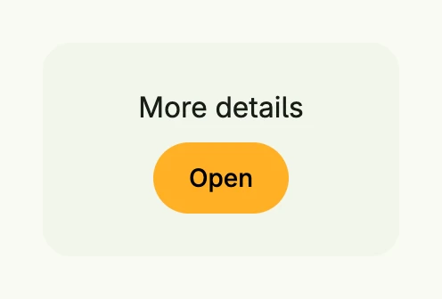

A hover group shows one view and fades to a second view while the mouse pointer is over it, e.g. to reveal
actions on a card. Both views are placed on top of each other, so give the group and both views the same
explicit size. Touch devices have no hover, so do not hide anything essential in the second view.



The screenshot shows the hovered state; without hover the group shows "Hover me".

```go
HoverGroup(
	VStack(Text("Hover me")).Frame(Frame{}.Size(L200, L120)),
	VStack(
		Text("More details"),
		PrimaryButton(nil).Title("Open"),
	).Gap(L8).Frame(Frame{}.Size(L200, L120)),
).BackgroundColor(M2).
	Border(Border{}.Radius(L16)).
	Frame(Frame{}.Size(L200, L120))
```

## Constructors

| Constructor | Description |
|-------------|-------------|
| `func HoverGroup(content core.View, hoveredContent core.View) THoverGroup` | HoverGroup creates a new hover group with default and hovered content. |

## Methods

| Method | Description |
|--------|-------------|
| `BackgroundColor(color Color) THoverGroup` | BackgroundColor sets the background color of the hover group. |
| `Border(border Border) THoverGroup` | Border sets the border styling of the hover group. |
| `Frame(frame Frame) THoverGroup` | Frame sets the layout frame of the hover group. |
| `Padding(padding Padding) THoverGroup` | Padding sets the inner spacing around the hover group's content. |
| `Position(position Position) THoverGroup` | Position sets the position of the hover group. |

## Related

- [Box](../box/), [Frame](../frame/), [Accordion](../../composite/accordion/)
