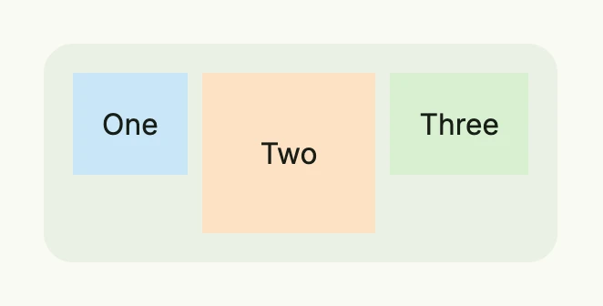

An HStack lays out its children in a row from leading to trailing. It is one of the two basic layout containers
and also serves as a styled, clickable container: it supports gaps, alignment, background, borders, hover and
pressed states and an action.



```go
return HStack(
	Text("One").BackgroundColor("#C9E7F8").Padding(Padding{}.All(L16)),
	Text("Two").BackgroundColor("#FDE2C4").Padding(Padding{}.All(L32)),
	Text("Three").BackgroundColor("#D8F0D2").Padding(Padding{}.All(L16)),
).Gap(L8).
	Alignment(Top).
	BackgroundColor(ColorCardBody).
	Padding(Padding{}.All(L16)).
	Border(Border{}.Radius(L16))
```

The [alignment](../alignment/) places the children vertically within the row and the whole content within the
stack. Use a [Spacer](../spacer/) to push children apart, and `Wrap(true)` to break the row into several rows
when the width is limited.

## Constructors

| Constructor | Description |
|-------------|-------------|
| `HStack(children ...core.View) TStack` | Creates a container which lays out the given children in a row. Nil children are skipped. |

`HStack` returns a `TStack` (the alias `THStack` exists for readability), the same type as [VStack](../vstack/)
and [Stack](../stack/).

## Methods

All methods of `TStack` are listed on the [Stack](../stack/#methods) page. The most used ones are `Gap`,
`Alignment`, `BackgroundColor`, `Padding`, `Border`, `Frame`, `FullWidth` and `Action`.

## Related

- [VStack](../vstack/), [Stack](../stack/), [Spacer](../spacer/), [Space](../space/)
- Tutorials: [Combining views](/docs/examples/tutorial-02-combining-views/), [Buttons](/docs/examples/tutorial-11-buttons/),
  [Absolute positions](/docs/examples/tutorial-41-absolute/)
