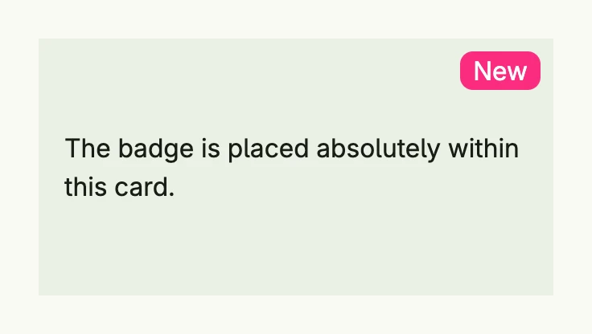

A `Position` takes a component out of the normal layout flow and places it by offsets, like CSS positioning. Use it
for badges, overlays or freely arranged elements such as a schedule. An absolutely positioned child is placed
relative to the nearest parent with `PositionOffset`, or relative to the viewport if there is none.



```go
badge := HStack(Text("New").Color(ColorWhite)).
	Position(Position{Type: PositionAbsolute, Top: L8, Right: L8}).
	BackgroundColor("#FA2C7F").
	Padding(Padding{}.Horizontal(L8)).
	Border(Border{}.Radius(L8))

return VStack(
	Text("The badge is placed absolutely within this card."),
	badge,
).
	// the parent must use PositionOffset to become the anchor of absolute children
	Position(Position{Type: PositionOffset}).
	BackgroundColor(ColorCardBody).
	Padding(Padding{}.All(L16)).
	Frame(Frame{}.Size(L320, L160))
```

## Fields

| Field | Description |
|-------|-------------|
| `Type PositionType` | How the offsets are applied, see below. |
| `Left`, `Top` | Distance from the left or top border of the anchor. |
| `Right`, `Bottom` | Distance from the right or bottom border of the anchor; alternatively set an explicit width or height. |
| `ZIndex int` | Drawing order of positioned elements; a higher index is drawn on top. |

| `PositionType` | Description |
|----------------|-------------|
| `PositionDefault` | Normal layout; offsets have no effect. |
| `PositionOffset` | Normal layout, then moved by the offsets. Also makes the element the anchor for absolute children. `PositionRelative` is an alias. |
| `PositionAbsolute` | Removed from the layout and placed within the nearest `PositionOffset` parent. Its size is not accounted for in the parent, so give the parent a size. |
| `PositionFixed` | Removed from the layout and placed relative to the viewport, independent of scrolling. |
| `PositionSticky` | Exists for completeness; its behavior on mobile clients is unspecified. |

`Position` has no methods. [VStack](../vstack/), [HStack](../hstack/), [ScrollView](../scroll_view/),
[Tabs](../../utility/tabs/) and other components accept it through their `Position` method.

## Related

- [Box](../box/) for overlapping content without offsets, [Frame](../frame/)
- Tutorials: [Absolute positions](/docs/examples/tutorial-41-absolute/), [Flow chart](/docs/examples/tutorial-98-flow-chart/)
