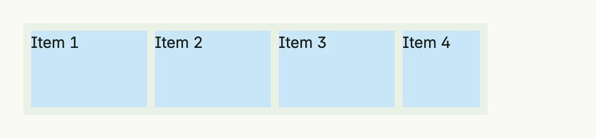

A scroll view shows a single child which may be larger than the scroll view itself and lets the user scroll it,
vertically by default or horizontally. Give the scroll view a size through its [Frame](../frame/), otherwise it
simply grows with its content.



```go
numbers := []int{1, 2, 3, 4, 5, 6, 7, 8, 9, 10}

return ScrollView(
	HStack(
		ForEach(numbers, func(n int) core.View {
			return Text(fmt.Sprintf("Item %d", n)).
				BackgroundColor("#C9E7F8").
				Frame(Frame{}.Size(L120, L80))
		})...,
	).Gap(L8),
).Axis(ScrollViewAxisHorizontal).
	BackgroundColor(ColorCardBody).
	Padding(Padding{}.All(L8)).
	Frame(Frame{Width: L480})
```

For chat-like views, `ScrollBehavior` controls whether the view follows content which is appended at the end, and
`ScrollToView` scrolls to the child with the given ID.

## Constructors

| Constructor | Description |
|-------------|-------------|
| `ScrollView(content core.View) TScrollView` | Creates a vertical scroll view around the given content. |

## Methods

| Method | Description |
|--------|-------------|
| `Axis(axis ScrollViewAxis) TScrollView` | Sets the scroll direction, `ScrollViewAxisVertical` or `ScrollViewAxisHorizontal`. |
| `BackgroundColor(color Color) TScrollView` | Sets the background color of the scroll view. |
| `Border(border Border) TScrollView` | Applies a border around the scroll view. |
| `Content(content core.View) TScrollView` | Replaces the scrollable content. |
| `Frame(frame Frame) TScrollView` | Sets the layout frame for the scroll view. |
| `FullWidth() TScrollView` | Sets the width to the full available width. |
| `ListLength(length int) TScrollView` | Sets the length of the content list; optional, but use it if the content is based on a list. |
| `Padding(padding Padding) TScrollView` | Sets the inner padding of the scroll view. |
| `Position(position Position) TScrollView` | Sets the [position](../position/) of the scroll view. |
| `ScrollAlignment(alignment ScrollAlignment) TScrollView` | Defines how the component should align the scroll target when scrolling into view. |
| `ScrollBehavior(behavior ScrollBehavior) TScrollView` | Defines how the component should behave when the scrollable content grows. |
| `ScrollButtonLabel(label string) TScrollView` | Sets the label of the scroll button when the component asks whether to scroll. |
| `ScrollToView(scrollToView string, animation ScrollAnimation) TScrollView` | Scrolls to the view with the given ID, smoothly or instantly. |

## Related

- [VStack](../vstack/), [Frame](../frame/), [Split View](../split_view/)
- Tutorials: [Scroll view](/docs/examples/tutorial-28-scrollview/), [Filtered list](/docs/examples/tutorial-88-filtered-list/),
  [Split view](/docs/examples/tutorial-99-split-view/)
