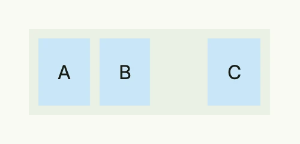

A space is an empty, fixed-size gap between two views. It applies its size in both directions, so it works in a
[VStack](../vstack/) as well as in an [HStack](../hstack/). For equal spacing between all children prefer the
`Gap` of the stack; use a space where one gap differs, and a [Spacer](../spacer/) for flexible space.



```go
return HStack(
	Text("A").BackgroundColor("#C9E7F8").Padding(Padding{}.All(L16)),
	Space(L8),
	Text("B").BackgroundColor("#C9E7F8").Padding(Padding{}.All(L16)),
	Space(L48),
	Text("C").BackgroundColor("#C9E7F8").Padding(Padding{}.All(L16)),
).BackgroundColor(ColorCardBody).
	Padding(Padding{}.All(L8))
```

## Constructors

| Constructor | Description |
|-------------|-------------|
| `Space(size Length) TSpace` | Creates a fixed-size spacer with the given length. |

## Methods

| Method | Description |
|--------|-------------|
| `Size(size Length) TSpace` | Changes the size of the space. |

## Related

- [Spacer](../spacer/), [Length](../../utility/length/), [Padding](../../utility/padding/)
- Tutorials: [Form](/docs/examples/tutorial-112-form/), [Navigation split view](/docs/examples/tutorial-87-navsplitview/)
