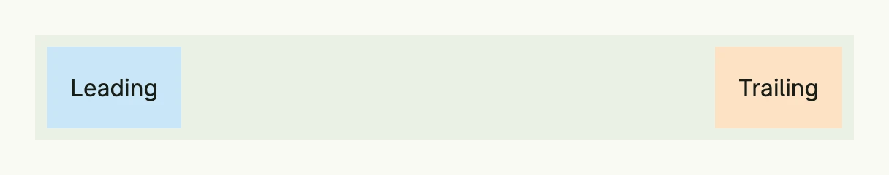

A spacer takes all the free space along the axis of its [VStack](../vstack/) or [HStack](../hstack/) and pushes
the other children apart. The stack needs a size for this to have a visible effect, e.g. through a
[Frame](../frame/) or `FullWidth()`.



```go
return HStack(
	Text("Leading").BackgroundColor("#C9E7F8").Padding(Padding{}.All(L16)),
	Spacer(),
	Text("Trailing").BackgroundColor("#FDE2C4").Padding(Padding{}.All(L16)),
).BackgroundColor(ColorCardBody).
	Padding(Padding{}.All(L8)).
	Frame(Frame{Width: L560})
```

## Constructors

| Constructor | Description |
|-------------|-------------|
| `Spacer() TSpacer` | Creates a dynamic spacer that expands to fill available space. |

## Methods

| Method | Description |
|--------|-------------|
| `BackgroundColor(backgroundColor Color) TSpacer` | Sets the background color of the spacer. |
| `Border(border Border)` | Intended to set the border of the spacer, but currently has no effect, see the note below. |
| `Frame(frame Frame) TSpacer` | Sets the frame of the spacer, allowing control over its layout constraints. |


`Border` neither returns the spacer nor modifies it, so it cannot be chained and has no effect.


## Related

- [Space](../space/), [HStack](../hstack/), [Frame](../frame/)
- Tutorials: [Combining views](/docs/examples/tutorial-02-combining-views/)
