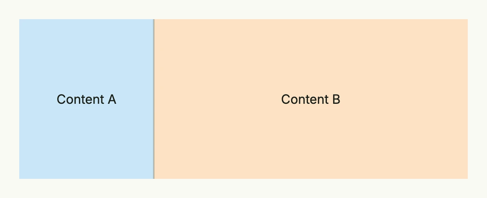

A split view shows two views side by side, or one above the other, separated by a handle which the user can drag
to change the ratio. Bind the ratio to a state to keep it across renders or to set it from code.



```go
ratio := core.AutoState[float64](wnd).Init(func() float64 {
	return 0.3
})

return SplitView(
	VStack(Text("Content A")).BackgroundColor("#C9E7F8").Frame(Frame{}.FullWidth().FullHeight()),
	VStack(Text("Content B")).BackgroundColor("#FDE2C4").Frame(Frame{}.FullWidth().FullHeight()),
).InputValue(ratio).
	MinRatio(0.2).
	MaxRatio(0.8).
	Frame(Frame{}.Size(L560, L200))
```

The ratio is the share of the first view, between 0 and 1; the default is 0.5.

## Constructors

| Constructor | Description |
|-------------|-------------|
| `SplitView(contentA core.View, contentB core.View) TSplitView` | Creates a horizontal split view with contentA on the left (or top) and contentB on the right (or bottom). |

## Methods

| Method | Description |
|--------|-------------|
| `ContentA(contentA core.View) TSplitView` | Replaces the left or top view. |
| `ContentB(contentB core.View) TSplitView` | Replaces the right or bottom view. |
| `Frame(frame Frame) TSplitView` | Sets the frame of the split view. |
| `InputValue(state *core.State[float64]) TSplitView` | Binds the ratio to a state which is updated when the user drags the handle. |
| `MaxRatio(maxRatio float64) TSplitView` | Sets the upper limit of the ratio. |
| `MinRatio(minRatio float64) TSplitView` | Sets the lower limit of the ratio. |
| `Orientation(orientation SplitViewOrientation) TSplitView` | Sets `SplitViewOrientationHorizontal` (default) or `SplitViewOrientationVertical`. |
| `Value(value float64) TSplitView` | Sets the ratio if no state is bound. |

## Related

- [TwoColumn](../twocolumn/), [ScrollView](../scroll_view/)
- Tutorials: [Split view](/docs/examples/tutorial-99-split-view/)
