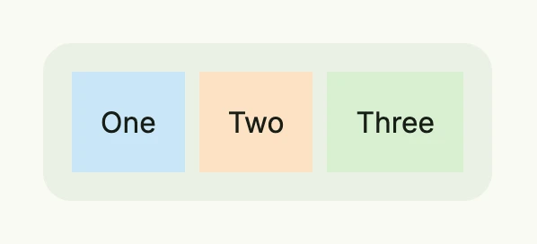
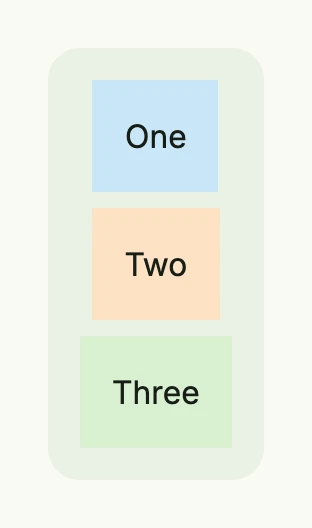

`TStack` is the type behind [VStack](../vstack/), [HStack](../hstack/) and the responsive `Stack`. `Stack` lays out
its children vertically on small windows and horizontally from the medium size class on (768dp and wider). Use it
for toolbars or groups of cards that should wrap into a column on phones.

| Window 1200dp wide | Window 400dp wide |
|--------------------|-------------------|
|  |  |

```go
return Stack(
	Text("One").BackgroundColor("#C9E7F8").Padding(Padding{}.All(L16)),
	Text("Two").BackgroundColor("#FDE2C4").Padding(Padding{}.All(L16)),
	Text("Three").BackgroundColor("#D8F0D2").Padding(Padding{}.All(L16)),
).Gap(L8).
	BackgroundColor(ColorCardBody).
	Padding(Padding{}.All(L16)).
	Border(Border{}.Radius(L16))
```

A stack clips its children. If a child has a shadow, add padding to the stack or call `NoClip(true)`.

## Constructors

| Constructor | Description |
|-------------|-------------|
| `Stack(children ...core.View) TStack` | Responsive stack which decides between a vertical and a horizontal layout by the window size class. |
| `VStack(children ...core.View) TStack` | Lays out the children in a column, see [VStack](../vstack/). |
| `HStack(children ...core.View) TStack` | Lays out the children in a row, see [HStack](../hstack/). |

Nil children are skipped, so you can pass the result of [`If`](../../utility/conditionals/) directly.

## Methods

| Method | Description |
|--------|-------------|
| `AccessibilityLabel(label string) DecoredView` | Sets the label used by screen readers for accessibility. |
| `Action(f func()) TStack` | Sets the callback function to be invoked when the stack is clicked or tapped. |
| `Alignment(alignment Alignment) TStack` | Sets how the children are aligned within the stack. |
| `Animation(animation Animation) TStack` | Sets an [animation](../../utility/animation/) of the stack. |
| `Append(children ...core.View) TStack` | Adds more children to the stack. |
| `Background(bg Background) TStack` | Sets a [background](../../utility/background/) of gradients and images. |
| `BackgroundColor(color Color) TStack` | Sets the background color of the stack. |
| `Border(border Border) DecoredView` | Sets the border of the stack. |
| `Enabled(enabled bool) TStack` | Has only an effect if StylePreset is applied, otherwise it is ignored. |
| `FocusedBackgroundColor(backgroundColor Color) TStack` | Sets the background color of the stack when it is focused (e.g., via keyboard navigation). |
| `FocusedBorder(border Border) TStack` | Sets the border styling when the stack is focused. |
| `FocusedOutline(outline Outline) TStack` | Sets the outline styling when the stack is focused. |
| `Font(font Font) TStack` | Sets the font style applied to text content inside the stack. |
| `Frame(frame Frame) DecoredView` | Sets the [frame](../frame/) of the stack. |
| `FullWidth() TStack` | Sets the width of the stack to the full available width. |
| `Gap(gap Length) TStack` | Sets the space between the children. |
| `HRef(url core.URI) TStack` | Sets the URL that the stack navigates to when clicked if no action is specified. |
| `HoveredBackgroundColor(backgroundColor Color) TStack` | Sets the background color of the stack when the user hovers over it. |
| `HoveredBorder(border Border) TStack` | Sets the border styling when the stack is hovered. |
| `HoveredOutline(outline Outline) TStack` | Sets the outline styling when the stack is hovered. |
| `HtmlTag(tag string) TStack` | Defines the html tag that the stack should be rendered as. |
| `ID(id string) TStack` | Assigns a unique identifier to the stack, useful for testing or referencing. |
| `Key(name, id string) TStack` | Identifies the action across renders by what it acts on, e.g. ("remove", rowID). |
| `Layout(layout StackLayout) TStack` | Sets the orientation: `StackLayoutAuto`, `StackLayoutVertical` or `StackLayoutHorizontal`; use `Wrap` for wrapping rows. |
| `NoClip(b bool) TStack` | Disables clipping of the children if set to true. |
| `Opacity(opacity float64) TStack` | Sets the visibility of this component in the range [0..1], including all children. |
| `Outline(outline Outline) TStack` | Sets the default [outline](../../utility/outline/) styling for the stack. |
| `Padding(padding Padding) DecoredView` | Sets the inner spacing around the children. |
| `Position(position Position) TStack` | Sets the [position](../position/) of the stack within its parent layout. |
| `PressedBackgroundColor(backgroundColor Color) TStack` | Sets the background color of the stack when it is pressed or clicked. |
| `PressedBorder(border Border) TStack` | Sets the border styling when the stack is pressed or clicked. |
| `PressedOutline(outline Outline) TStack` | Sets the outline styling when the stack is pressed or clicked. |
| `Responsive(fn func(wnd core.Window, stack TStack) TStack) TStack` | Registers a function which adapts the stack to the window right before rendering. |
| `StylePreset(preset StylePreset) TStack` | Applies a predefined style preset to the stack, controlling its appearance. |
| `Target(target string) TStack` | Sets the name of the browsing context, like _self, _blank, _parent, _top. |
| `TextColor(textColor Color) TStack` | Sets the color of text content inside the stack. |
| `Transformation(transformation Transformation) TStack` | Applies a [transformation](../../utility/transformation/) like rotation or scaling. |
| `Visible(visible bool) DecoredView` | Controls the visibility of the stack; setting false hides it. |
| `With(fn func(stack TStack) TStack) TStack` | Applies a transformation function to the stack itself and returns the result. |
| `WithFrame(fn func(Frame) Frame) DecoredView` | Applies a transformation function to the stack's frame and returns the updated component. |
| `WithPadding(padding Padding) TStack` | Like `Padding`, but returns `TStack` so that you can continue the chain. |
| `Wrap(wrap bool) TStack` | Wraps the children into multiple rows if a horizontal stack has a limited width. |

## Related

- [VStack](../vstack/), [HStack](../hstack/), [View That Matches](../../utility/view_that_matches/)
- Tutorials: [Responsive](/docs/examples/tutorial-06-responsive/), [Typography](/docs/examples/tutorial-111-typography/),
  [Split view](/docs/examples/tutorial-99-split-view/)
