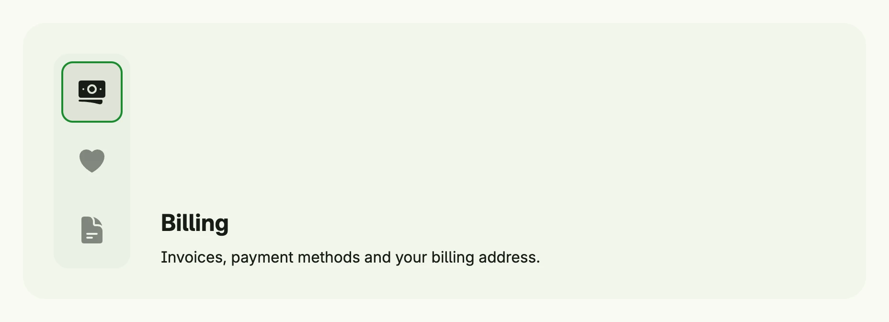

The switcher of package [`switcher`](https://github.com/worldiety/nago/tree/main/presentation/ui/switcher) shows
one of several pages and a bar of icon buttons to switch between them. Each page has an ID, a title, an icon, its
content and an optional banner image. By default the bar is vertical on wide windows and horizontal on small ones.



```go
pages := []switcher.TSwitcherPage{
	switcher.SwitcherPage("billing", "Billing", icons.Banknotes,
		VStack(
			Text("Billing").Font(HeadlineSmall),
			Text("Invoices, payment methods and your billing address."),
		).Alignment(Leading).Gap(L8),
	),
	switcher.SwitcherPage("favorites", "Favorites", icons.Heart,
		Text("Everything you marked as favorite."),
	),
	switcher.SwitcherPage("documents", "Documents", icons.DocumentText,
		Text("Contracts and other documents."),
	),
}

return switcher.Switcher(pages, core.AutoState[string](wnd)).
	Frame(Frame{Width: L880})
```

The state holds the ID of the active page; if it is empty, the first page is shown. The constructors panic if
`pages` is empty or if the page IDs are empty or not unique.

## Constructors

| Constructor | Description |
|-------------|-------------|
| `switcher.Switcher(pages []TSwitcherPage, state *core.State[string]) TSwitcher` | Responsive variant which decides between a horizontal and a vertical layout. |
| `switcher.HSwitcher(pages []TSwitcherPage, state *core.State[string]) TSwitcher` | Fixed horizontal variant of Switcher. |
| `switcher.VSwitcher(pages []TSwitcherPage, state *core.State[string]) TSwitcher` | Fixed vertical variant of Switcher. |
| `switcher.SwitcherPage(id, title string, icon core.SVG, content core.View) TSwitcherPage` | Creates a page to be used in a TSwitcher. |

## Methods

`TSwitcher`:

| Method | Description |
|--------|-------------|
| `Append(pages ...TSwitcherPage) TSwitcher` | Adds more pages to the switcher. |
| `ContentNoPadding() TSwitcher` | Removes the predefined padding of the content part. |
| `DynamicHeight() TSwitcher` | Sets the switcher to dynamically change its height by the active page. |
| `Frame(frame ui.Frame) TSwitcher` | Sets the switcher's frame. |
| `FullWidth() TSwitcher` | Sets the switcher's frame to full width. |
| `ID(id string) TSwitcher` | Assigns a unique identifier to the switcher. |
| `ImageObjectFit(objectFit ui.ObjectFit) TSwitcher` | Sets how the banner images of the pages are fitted. |
| `InputValue(input *core.State[string]) TSwitcher` | Binds the switcher to an external string state, allowing it to be controlled from outside the component. |
| `Layout(layout SwitcherLayout) TSwitcher` | Sets the layout: `SwitcherLayoutAuto`, `SwitcherLayoutVertical` or `SwitcherLayoutHorizontal`. |
| `With(fn func(switcher TSwitcher) TSwitcher) TSwitcher` | Applies a transformation function to the switcher itself and returns the result. |

`TSwitcherPage`:

| Method | Description |
|--------|-------------|
| `Content(content core.View) TSwitcherPage` | Sets the content of a switcher page. |
| `Icon(icon core.SVG) TSwitcherPage` | Sets the toggle icon of a switcher page. |
| `Img(imgUri core.URI) TSwitcherPage` | Sets an optional banner image uri. |
| `ImgAdaptive(light, dark core.URI) TSwitcherPage` | Sets an optional banner image uri by light/dark mode. |
| `Title(title string) TSwitcherPage` | Sets the title of a switcher page. |

## Related

- [Tabs](../../utility/tabs/), [Stack](../stack/)
- Tutorials: [Switcher](/docs/examples/tutorial-96-switcher/)
