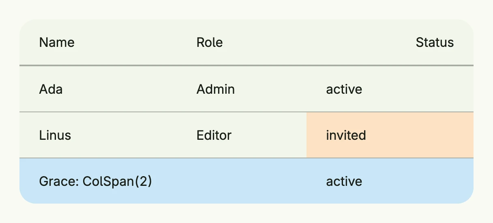

A table row groups the [cells](../table_cell/) of one line of a [Table](../../composite/table/) and sets row-level
styling: height, background, hover background and a click action for the whole row.



```go
return Table(
	TableColumn(Text("Name")),
	TableColumn(Text("Role")).Width(L160),
	TableColumn(Text("Status")).Alignment(Trailing),
).Rows(
	TableRow(
		TableCell(Text("Ada")),
		TableCell(Text("Admin")),
		TableCell(Text("active")),
	),
	TableRow(
		TableCell(Text("Linus")),
		TableCell(Text("Editor")),
		TableCell(Text("invited")).BackgroundColor("#FDE2C4"),
	).HoveredBackgroundColor(ColorCardFooter),
	TableRow(
		TableCell(Text("Grace: ColSpan(2)")).ColSpan(2),
		TableCell(Text("active")),
	).BackgroundColor("#C9E7F8"),
).Frame(Frame{Width: L560})
```

## Constructors

| Constructor | Description |
|-------------|-------------|
| `TableRow(cells ...TTableCell) TTableRow` | Creates a new table row with the given cells. |

## Methods

| Method | Description |
|--------|-------------|
| `Action(action func()) TTableRow` | Sets a click/tap action for the entire row. |
| `Append(cells ...TTableCell) TTableRow` | Adds more cells to the row. |
| `BackgroundColor(backgroundColor Color) TTableRow` | Sets the background color of the row. |
| `Height(height Length) TTableRow` | Sets the row height. |
| `HoveredBackgroundColor(backgroundColor Color) TTableRow` | Sets the background color when the row is hovered. |
| `Key(name, id string) TTableRow` | Identifies the action across renders by what it acts on, e.g. ("row", rowID). |

## Related

- [Table](../../composite/table/), [Table Cell](../table_cell/), [Table Column](../table_column/)
- Tutorials: [Table](/docs/examples/tutorial-18-table/)
