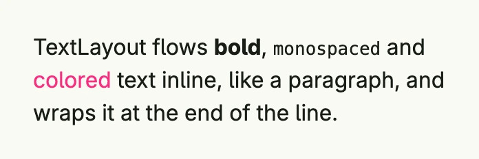

A text layout flows several [Text](../../basic/text/) views inline, like the words of a paragraph, and wraps them
at the end of the line. Use it to mix fonts, colors or links within one paragraph. The alignment of the single
texts is ignored; the layout's own `Alignment` applies.



```go
return TextLayout(
	Text("TextLayout flows "),
	Text("bold").Font(Font{Weight: HeadlineAndTitleFontWeight}),
	Text(", "),
	Text("monospaced").Font(Monospace),
	Text(" and "),
	Text("colored").Color("#FA2C7F"),
	Text(" text inline, like a paragraph, and wraps it at the end of the line."),
).Frame(Frame{Width: L320})
```

## Constructors

| Constructor | Description |
|-------------|-------------|
| `TextLayout(views ...core.View) TTextLayout` | Lays out multiple text elements inline; other views are allowed if they can be rendered inline. |

## Methods

| Method | Description |
|--------|-------------|
| `AccessibilityLabel(label string) DecoredView` | Sets the screen-reader label describing the layout's content or purpose. |
| `Action(f func()) TTextLayout` | Sets a callback function that is executed when the layout is clicked. |
| `Alignment(alignment TextAlignment) TTextLayout` | Defines the text alignment within the layout. |
| `Append(views ...core.View) TTextLayout` | Adds more views to the layout. |
| `BackgroundColor(backgroundColor Color) DecoredView` | Sets the background color of the layout. |
| `Border(border Border) DecoredView` | Applies the given border (widths, radii, colors, shadow) to the layout. |
| `Font(font Font) TTextLayout` | Sets the font styling for the text in the layout. |
| `Frame(f Frame) DecoredView` | Sets the dimensions and position of the layout. |
| `FullWidth() TTextLayout` | Expands the layout to occupy the full available width. |
| `Padding(padding Padding) DecoredView` | Sets the inner spacing of the layout. |
| `Visible(visible bool) DecoredView` | Toggles visibility of the layout. |
| `WithFrame(fn func(Frame) Frame) DecoredView` | Modifies the current frame using the provided function. |

## Related

- [Text](../../basic/text/), [Rich Text](../../basic/rich_text/), [Font](../../utility/font/)
