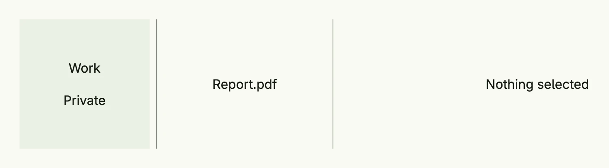

The three-column layout of package [`navsplitview`](https://github.com/worldiety/nago/tree/main/presentation/ui/navsplitview)
adds a sidebar to the [TwoColumn](../twocolumn/) layout. From left to right it shows sidebar, content and detail,
e.g. folders, files and a preview. On large windows the sidebar collapses into a toggle button; on small and
medium windows only one column is shown at a time.



```go
return navsplitview.ThreeColumn(navsplitview.NavLinks{
	"folders": VStack(
		navsplitview.ListItem(navsplitview.KindContent, "work", Text("Work")).
			DeleteTarget(navsplitview.KindDetail),
		navsplitview.ListItem(navsplitview.KindContent, "private", Text("Private")).
			DeleteTarget(navsplitview.KindDetail),
	).FullWidth(),
	"none": Text("Nothing selected"),
	"work": VStack(
		navsplitview.ListItem(navsplitview.KindDetail, "report", Text("Report.pdf")),
	).FullWidth(),
	"private": VStack(
		navsplitview.ListItem(navsplitview.KindDetail, "photo", Text("Photo.jpg")),
	).FullWidth(),
	"report": Text("Quarterly report"),
	"photo":  Text("Holiday photo"),
}).Default("folders", "work", "none").
	WidthSidebar(L160).
	WidthContent(L200).
	BackgroundColorSidebar(ColorCardBody).
	Frame(Frame{Width: L880, Height: L160})
```

`DeleteTarget(KindDetail)` clears the detail column when another folder is selected. The screenshot was taken in a
window 1300dp wide. The factories, `ListItem` and the navigation functions are described on the
[TwoColumn](../twocolumn/) page; `NavigateSidebar` opens a view in the sidebar from code.

## Constructors

| Constructor | Description |
|-------------|-------------|
| `navsplitview.ThreeColumn(nav Factory) TThreeColumn` | Creates a three-column layout with the given navigation factory; the order is sidebar, content, detail. |

## Methods

| Method | Description |
|--------|-------------|
| `AlignmentContent(alignment ui.Alignment) TThreeColumn` | Sets the alignment of the content column. |
| `AlignmentDetail(alignment ui.Alignment) TThreeColumn` | Sets the alignment of the detail column. |
| `AlignmentSidebar(alignment ui.Alignment) TThreeColumn` | Sets the alignment of the sidebar column. |
| `BackgroundColorContent(bg ui.Color) TThreeColumn` | Sets the background color of the content column. |
| `BackgroundColorDetail(bg ui.Color) TThreeColumn` | Sets the background color of the detail column. |
| `BackgroundColorSidebar(bg ui.Color) TThreeColumn` | Sets the background color of the sidebar column. |
| `Default(sidebar, content, detail ViewID) TThreeColumn` | Sets the views shown when nothing is selected. |
| `Frame(frame ui.Frame) TThreeColumn` | Sets the frame of the layout. |
| `FullWidth() TThreeColumn` | Sets the width to the full available width. |
| `ID(id string) TThreeColumn` | Sets the ID which distinguishes several split views on one page. |
| `WidthContent(width ui.Length) TThreeColumn` | Sets the width of the content column, 25rem by default. |
| `WidthDetail(width ui.Length) TThreeColumn` | Sets the width of the detail column, the remaining space by default. |
| `WidthSidebar(width ui.Length) TThreeColumn` | Sets the width of the sidebar column, 20rem by default. |

The alignment setters only take effect on extra-large windows; in the other layouts the columns are centered.

## Related

- [TwoColumn](../twocolumn/), [Split View](../split_view/)
- Tutorials: [Navigation split view](/docs/examples/tutorial-87-navsplitview/)
