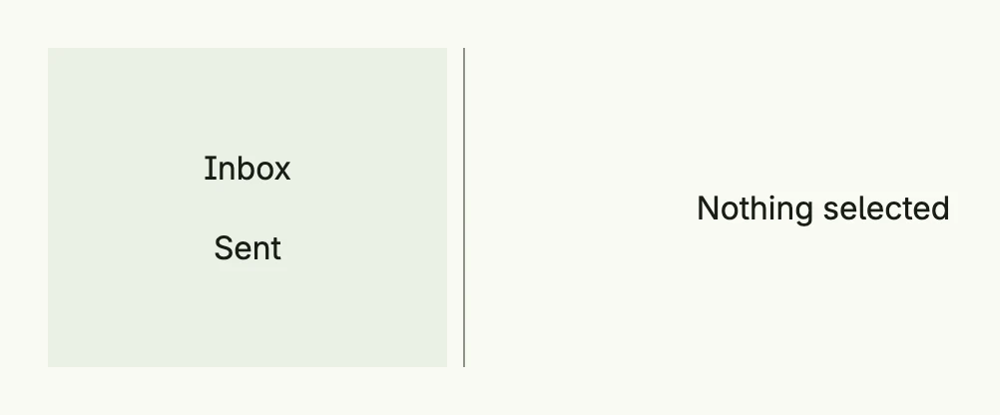

The two-column layout of package [`navsplitview`](https://github.com/worldiety/nago/tree/main/presentation/ui/navsplitview)
shows a list (content) next to the details of the selected entry (detail), like a mail client. The selection is
kept in the query parameters of the current page, so it survives reloads and works with the browser's back button.
On small and medium windows only one column is shown at a time, with a back button on the detail.



```go
return navsplitview.TwoColumn(navsplitview.NavLinks{
	"list": VStack(
		navsplitview.ListItem(navsplitview.KindDetail, "inbox", Text("Inbox")),
		navsplitview.ListItem(navsplitview.KindDetail, "sent", Text("Sent")),
	).FullWidth(),
	"none":  Text("Nothing selected"),
	"inbox": Text("3 new messages"),
	"sent":  Text("No messages sent yet"),
}).Default("list", "none").
	WidthContent(L200).
	BackgroundColorContent(ColorCardBody).
	Frame(Frame{Width: L560, Height: L160})
```

Each column shows a view identified by a `ViewID`. The factory creates the view for an ID: `NavLinks` maps IDs to
views, `NavFnLinks` maps them to functions which are only called when needed, and `NavFn` is a single function.
`ListItem` opens a view in the given column when it is clicked; `NavigateContent` and `NavigateDetail` do the
same from code. If you use more than one split view on a page, give each an `ID` and set it as `Prefix` of its
list items.

## Constructors

| Constructor | Description |
|-------------|-------------|
| `navsplitview.TwoColumn(nav Factory) TTwoColumn` | Creates a two-column layout whose views are created by the factory. |
| `navsplitview.ListItem(kind TargetKind, target ViewID, content core.View) TListItem` | Creates a clickable entry which shows `target` in the column `KindContent` or `KindDetail`. |

## Methods

`TTwoColumn`:

| Method | Description |
|--------|-------------|
| `BackgroundColorContent(bg ui.Color) TTwoColumn` | Sets the background color of the content column. |
| `BackgroundColorDetail(bg ui.Color) TTwoColumn` | Sets the background color of the detail column. |
| `Default(content, detail ViewID) TTwoColumn` | Sets the views shown when nothing is selected. |
| `Frame(frame ui.Frame) TTwoColumn` | Sets the frame of the layout. |
| `FullWidth() TTwoColumn` | Sets the width to the full available width. |
| `ID(id string) TTwoColumn` | Sets the ID which distinguishes several split views on one page. |
| `WidthContent(width ui.Length) TTwoColumn` | Sets the width of the content column, 30rem by default. |
| `WidthDetail(width ui.Length) TTwoColumn` | Sets the width of the detail column, the remaining space by default. |

`TListItem`:

| Method | Description |
|--------|-------------|
| `DeleteTarget(kind TargetKind) TListItem` | Clears the selection of the given column when the item is clicked. |
| `Frame(frame ui.Frame) TListItem` | Sets the frame of the item, full width by default. |
| `Prefix(id string) TListItem` | Sets the ID of the split view the item belongs to. |

## Related

- [ThreeColumn](../threecolumn/), [Split View](../split_view/), [List](../../composite/list/)
- Tutorials: [Navigation split view](/docs/examples/tutorial-87-navsplitview/)
