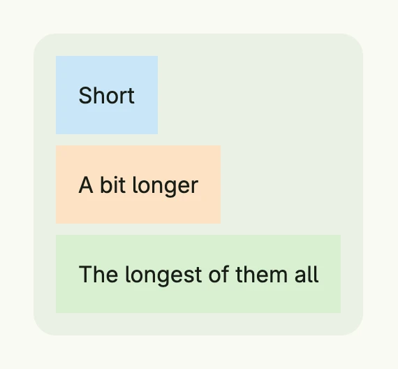

A VStack lays out its children in a column from top to bottom. It is the most common container of a Nago view and
also serves as a styled, clickable container: it supports gaps, alignment, background, borders, hover and pressed
states and an action.



```go
return VStack(
	Text("Short").BackgroundColor("#C9E7F8").Padding(Padding{}.All(L16)),
	Text("A bit longer").BackgroundColor("#FDE2C4").Padding(Padding{}.All(L16)),
	Text("The longest of them all").BackgroundColor("#D8F0D2").Padding(Padding{}.All(L16)),
).Gap(L8).
	Alignment(Leading).
	BackgroundColor(ColorCardBody).
	Padding(Padding{}.All(L16)).
	Border(Border{}.Radius(L16))
```

The [alignment](../alignment/) places the children horizontally within the column and the whole content within
the stack. A VStack wraps its content; call `FullWidth()` or set a [Frame](../frame/) to give it a size.

## Constructors

| Constructor | Description |
|-------------|-------------|
| `VStack(children ...core.View) TStack` | Creates a container which lays out the given children in a column. Nil children are skipped. |

`VStack` returns a `TStack` (the alias `TVStack` exists for readability), the same type as [HStack](../hstack/)
and [Stack](../stack/). The heading helpers `H1` to `H6` and `Heading(level int, title string)` of the
[text](../../basic/text/) components return a `TVStack` as well.

## Methods

All methods of `TStack` are listed on the [Stack](../stack/#methods) page. The most used ones are `Gap`,
`Alignment`, `BackgroundColor`, `Padding`, `Border`, `Frame`, `FullWidth` and `Action`.

## Related

- [HStack](../hstack/), [Stack](../stack/), [Spacer](../spacer/), [ScrollView](../scroll_view/)
- Tutorials: [Hello World](/docs/examples/tutorial-01-helloworld/),
  [Combining views](/docs/examples/tutorial-02-combining-views/), [Container](/docs/examples/tutorial-04-container/)
