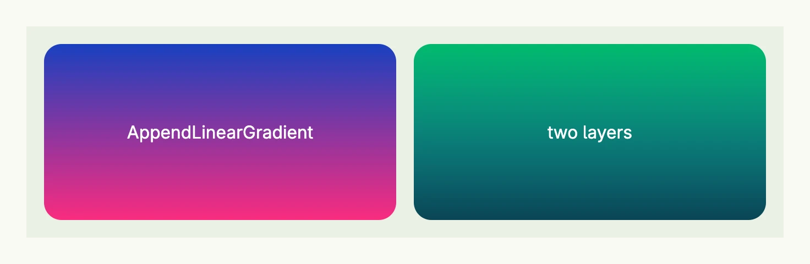

A `Background` paints a stack of layers behind the content of a [VStack](../../layout/vstack/) or
[HStack](../../layout/hstack/): linear gradients and images. Each appended layer is drawn on top of the previous
ones, so add the image first and a gradient for readability afterwards. For a plain color use `BackgroundColor`
instead.



```go
return HStack(
	VStack(Text("AppendLinearGradient").Color(ColorWhite)).
		Background(Background{}.AppendLinearGradient("#1940BF", "#FA2C7F")).
		Frame(Frame{}.Size(L320, L160)).
		Border(Border{}.Radius(L16)),
	VStack(Text("two layers").Color(ColorWhite)).
		Background(Background{}.
			AppendLinearGradient("#01BA6C", "#1CCDFB").
			AppendLinearGradient("#00000000", "#000000AA"),
		).
		Frame(Frame{}.Size(L320, L160)).
		Border(Border{}.Radius(L16)),
).Gap(L16).BackgroundColor(ColorCardBody).Padding(Padding{}.All(L16))
```

The gradients run from top to bottom. Theme [colors](../color/) like `M5` can be used as gradient colors as well.

## Methods

| Method | Description |
|--------|-------------|
| `AppendLinearGradient(colors ...Color) Background` | Appends a gradient equally distributed between all given colors on top of the prior layers. |
| `AppendURI(uri core.URI) Background` | Appends the image at the given URI on top of the prior layers. |
| `Fit(fit ObjectFit) Background` | Sets how images are fitted, e.g. `FitCover` or `FitContain`. |

## Related

- [Color](../color/), [Stack](../../layout/stack/)
- Tutorials: [Background](/docs/examples/tutorial-83-background/)
