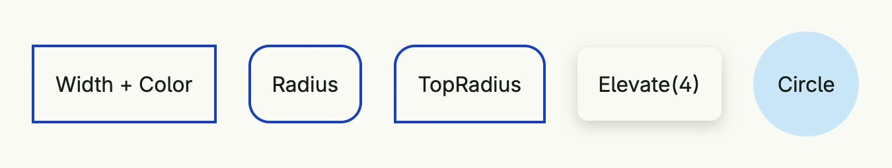

A `Border` describes the corner radii, the width and color of each edge, the line style and an optional
[shadow](../shadow/) of a component. Start with the zero value and chain the setters. The border width adds to
the size of the component.



```go
return HStack(
	Text("Width + Color").Padding(Padding{}.All(L16)).
		Border(Border{}.Width(L2).Color("#1940BF")),
	Text("Radius").Padding(Padding{}.All(L16)).
		Border(Border{}.Width(L2).Color("#1940BF").Radius(L16)),
	Text("TopRadius").Padding(Padding{}.All(L16)).
		Border(Border{}.Width(L2).Color("#1940BF").TopRadius(L16)),
	Text("Elevate(4)").Padding(Padding{}.All(L16)).
		Border(Border{}.Radius(L8).Elevate(4)),
	VStack(Text("Circle")).BackgroundColor("#C9E7F8").Frame(Frame{}.Size(L80, L80)).
		Border(Border{}.Circle()),
).Gap(L24)
```

## Fields

To style single edges or corners, set the fields directly: `TopLeftRadius`, `TopRightRadius`, `BottomLeftRadius`,
`BottomRightRadius`, `LeftWidth`, `TopWidth`, `RightWidth`, `BottomWidth`, `LeftColor`, `TopColor`, `RightColor`,
`BottomColor`, `BoxShadow` and `BorderStyle`.

## Methods

| Method | Description |
|--------|-------------|
| `BottomRadius(radius Length) Border` | Sets the same corner radius for both bottom corners. |
| `Circle() Border` | Sets all corner radii to a large value, resulting in a circle/ellipse shape. |
| `Color(c Color) Border` | Sets the same border color on all four sides. |
| `Elevate(elevation core.DP) Border` | Applies a shadow effect based on a given elevation in device-independent pixels (DP). |
| `Radius(radius Length) Border` | Sets the same corner radius for all four corners. |
| `Shadow(radius Length) Border` | Adds a shadow with the given blur radius and a default semi-transparent black color. |
| `Style(style BorderStyle) Border` | Sets the border style, e.g. `BorderStyleSolid`, `BorderStyleDashed` or `BorderStyleDotted`. |
| `TopRadius(radius Length) Border` | Sets the same corner radius for both top corners. |
| `Width(width Length) Border` | Sets the same border thickness on all four sides. |

## Related

- [Shadow](../shadow/), [Outline](../outline/), [Color](../color/), [Length](../length/)
- Tutorials: [Combining views](/docs/examples/tutorial-02-combining-views/),
  [Custom button](/docs/examples/tutorial-09-custom-button/)
