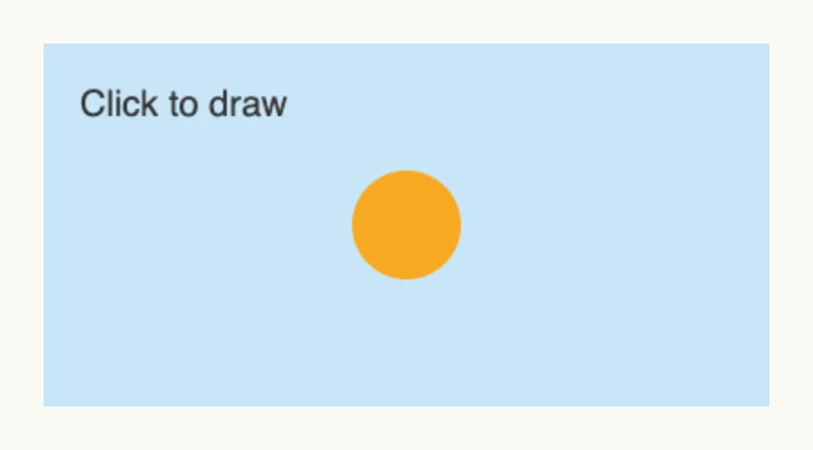

A canvas is a drawing surface for free-form graphics, e.g. games, diagrams or image editors. It lives in package
`presentation/ui/canvas` and maps to the canvas element of the browser. `Canvas(id)` places the surface in the
view; `Context2D(wnd, id)` draws on it with the same id. The drawing calls are sent to the frontend
immediately and are not part of the view tree, so draw in reaction to input events which you register with
`wnd.AddInputListener` on the same id, e.g. pointer events, or `InputEventInvalidate`, which the canvas sends
when an image loaded with `LoadImage` is ready.



```go
const id = "drawing"

ctx := canvas.Context2D(wnd, id)

// draw a scene and a circle wherever the user clicks
wnd.AddInputListener(id, func(evt core.InputEvent) {
	ctx.Clear()
	ctx.FillColor("#C9E7F8").FillRect(0, 0, 400, 200)
	ctx.Font("20px sans-serif").FillColor("#333333").FillText("Click to draw", 20, 40, 300)
	ctx.BeginPath().Arc(evt.X, evt.Y, 30, 0, 2*math.Pi, false).FillColor("#F7A823").Fill()
}, core.InputEventPointerDown)

return canvas.Canvas(id).Frame(Frame{Width: L400, Height: L200})
```

Always set an explicit size: with relative sizes, the browser stretches its default canvas of 300×150 pixels.
The methods of `TContext2D` follow the
[CanvasRenderingContext2D](https://developer.mozilla.org/en-US/docs/Web/API/CanvasRenderingContext2D) of the
browser. Record calls into a display list with `NewList` and `EndList` and replay it with `CallList` to send
complex scenes only once.

## Constructors

| Constructor | Description |
|-------------|-------------|
| `func Canvas(id string) TCanvas` | Creates a canvas with the given id. |
| `func Context2D(wnd core.Window, id string) TContext2D` | Creates a context which draws on the canvas with the given id. |

## Methods

`TCanvas`:

| Method | Description |
|--------|-------------|
| `Frame(frame ui.Frame) TCanvas` | Frame sets the layout constraints for the canvas, e.g. width and height. |

`TContext2D`, every method returns the `TContext2D`:

| Method | Description |
|--------|-------------|
| `Arc(x, y, radius, startAngle, endAngle float64, antiClockwise bool)` | Arc adds a circular arc to the current sub-path. |
| `ArcTo(x1, y1, x2, y2, radius float64)` | ArcTo adds a circular arc to the current sub-path using the given control points and radius. |
| `BeginPath()` | BeginPath starts a new path by emptying the list of sub-paths. |
| `BezierCurveTo(cp1x, cp1y, cp2x, cp2y, x, y float64)` | BezierCurveTo adds a cubic Bézier curve to the current sub-path. |
| `CallList(handle uint64)` | CallList replays a previously recorded display list identified by handle. |
| `Clear()` | Clear clears the entire canvas. |
| `ClearRect(x, y, width, height float64)` | ClearRect erases the pixels in a rectangular area, making it fully transparent. |
| `Clip()` | Clip turns the current path into the current clipping region. |
| `ClosePath()` | ClosePath adds a straight line from the current point to the start of the current sub-path. |
| `DrawImage(hnd ImgHnd, dx, dy float64)` | DrawImage is a simplified version of DrawImage2 that only takes destination coordinates. |
| `DrawImage2(hnd ImgHnd, dx, dy, dw, dh, sx, sy, sw, sh float64)` | DrawImage2 draws an image onto the canvas. |
| `EndList()` | EndList ends a display list recording previously started with NewList. |
| `Fill()` | Fill fills the current path with the current fill style. |
| `FillColor(color color.Color)` | FillColor sets the FillStyle as an absolute color value for subsequent drawing operations. |
| `FillRect(x, y, width, height float64)` | FillRect draws a filled rectangle whose starting point is at (x, y) and whose size is specified by width and height. |
| `FillStyle(style string)` | FillStyle specifies the color, gradient, or pattern to use inside shapes. |
| `FillText(text string, x, y, maxWidth float64)` | FillText draws a text string at the specified coordinates using the current fillStyle. |
| `Font(font string)` | Font sets the font used for text operations, e.g. "16px sans-serif". |
| `LineCap(cap string)` | Sets the shape of line ends: `butt`, `round` or `square`. |
| `LineJoin(join string)` | Sets the shape of line corners: `round`, `bevel` or `miter`. |
| `LineTo(x, y float64)` | LineTo adds a straight line to the current sub-path from the last point to (x, y). |
| `LineWidth(width float64)` | Sets the width of lines. |
| `LoadImage(hnd ImgHnd, url core.URI)` | Loads the image at the url under the given handle for `DrawImage`. |
| `MiterLimit(limit float64)` | Sets the miter limit ratio of line corners. |
| `MoveTo(x, y float64)` | MoveTo begins a new sub-path at the point (x, y). |
| `NewList(handle uint64)` | NewList begins recording a new display list identified by handle. |
| `QuadraticCurveTo(cpx, cpy, x, y float64)` | QuadraticCurveTo adds a quadratic Bézier curve; cpx/cpy is the control point, x/y the end point. |
| `Rect(x, y, width, height float64)` | Rect adds a rectangle to the current path. |
| `Restore()` | Restore restores the most recently saved canvas state. |
| `Rotate(angle float64)` | Rotate adds a rotation to the transformation matrix. |
| `Save()` | Save saves the entire state of the canvas by pushing it onto a stack. |
| `Scale(x, y float64)` | Scale adds a scaling transformation to the canvas units. |
| `SetTransform(a, b, cc, d, e, f float64)` | SetTransform resets the current transformation to the identity matrix and applies the given matrix. |
| `ShadowBlur(blur float64)` | ShadowBlur specifies the level of the blurring effect. |
| `ShadowColor(clr string)` | ShadowColor sets the color of shadows. |
| `ShadowColorValue(clr color.Color)` | ShadowColorValue sets the shadow color from an absolute color value. |
| `ShadowOffsetX(offsetX float64)` | ShadowOffsetX sets the horizontal distance the shadow will be offset. |
| `ShadowOffsetY(offsetY float64)` | ShadowOffsetY sets the vertical distance the shadow will be offset. |
| `Stroke()` | Stroke strokes the current path with the current stroke style. |
| `StrokeColor(clr color.Color)` | StrokeColor sets the stroke style as an absolute color value. |
| `StrokeRect(x, y, width, height float64)` | StrokeRect draws a stroked rectangle according to the current strokeStyle. |
| `StrokeStyle(style string)` | StrokeStyle sets the color, gradient, or pattern used for strokes around shapes. |
| `StrokeText(text string, x, y, maxWidth float64)` | StrokeText draws the outlines of a text string at the specified coordinates. |
| `TextAlign(align string)` | TextAlign sets the text alignment. |
| `TextBaseline(baseline string)` | TextBaseline sets the text baseline. |
| `Translate(x, y float64)` | Translate adds a translation transformation, moving the canvas origin to (x, y). |

## Related

- [Image](../../basic/image/), [Flow Chart](../../composite/flow_chart/)
- Tutorials: [Canvas](/docs/examples/tutorial-93-canvas/), [Canvas editor](/docs/examples/tutorial-94-canvas-editor/)
