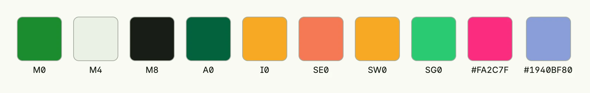

A `Color` is either a hex value like `#rrggbb` or `#rrggbbaa`, or the name of a theme color like `M4`. Prefer the
theme colors: they follow the configured [color set](../colorset/) and switch automatically between light and dark
mode. Hex values stay the same in both modes.



```go
colors := []Color{M0, M4, M8, A0, I0, SE0, SW0, SG0, "#FA2C7F", Color("#1940BF").WithTransparency(50)}

return HStack(
	ForEach(colors, func(c Color) core.View {
		return VStack(
			VStack().BackgroundColor(c).
				Frame(Frame{}.Size(L64, L64)).
				Border(Border{}.Radius(L8).Width(L1).Color(ColorLine)),
			Text(string(c)).Font(Small),
		).Gap(L4)
	})...,
).Gap(L16).Alignment(Top)
```

## Theme colors

| Constant | Usage |
|----------|-------|
| `M0` | Main source color. |
| `M1` to `M9` | Shades of the main color: `M1` background, `M2` first level containers, `M3` card bottom, `M4` card body, `M5` lines, `M6` hovered containers, `M7` muted text and icons, `M8` text and icons, `M9` card top. |
| `A0`, `A1` | Accent source color and a variant for progress bars, headlines or borders. |
| `I0`, `I1` | Interactive source color and a variant for buttons. |
| `SE0`, `SW0`, `SG0`, `SV0` | Semantic colors for error, warning, good and informative. |
| `SI0`, `ST0` | Disabled input and text on disabled input. |

Aliases with readable names exist, e.g. `ColorBackground` (`M1`), `ColorCardBody` (`M4`), `ColorCardTop` (`M9`),
`ColorCardFooter` (`M3`), `ColorLine` (`M5`), `ColorText` (`M8`), `ColorIconsMuted` (`M7`), `ColorAccent` (`A0`),
`ColorInteractive` (`I0`), `ColorError` (`SE0`), `ColorSemanticGood`, `ColorSemanticWarn` and the fixed
`ColorBlack` and `ColorWhite`.

## Methods

`ui.Color` is an alias of `color.Color` in package
[`application/color`](https://github.com/worldiety/nago/tree/main/application/color).

| Method | Description |
|--------|-------------|
| `IsAbsolute() bool` | Reports whether the color is a hex value rather than a theme color name. |
| `WithChromaAndTone(chroma float64, tone float64) (Color, error)` | Applies the given chroma and tone values on the actual hue value using the HCT colorspace. |
| `WithTransparency(a int8) Color` | Updates the alpha value part of the color (0-100), where 25% transparent means 75% opaque. |
| `WithoutTransparency() Color` | Removes the alpha value of the color. |

## Color swatch

`colorpicker.Color(color ui.Color) TColor` of package
[`colorpicker`](https://github.com/worldiety/nago/tree/main/presentation/ui/colorpicker) renders a small swatch
of a color, e.g. in a list of selectable colors. It has no further methods.

## Related

- [Colors](../colorset/), [Palette Picker](../../composite/palette_picker/), [Background](../background/)
- Tutorials: [Colors](/docs/examples/tutorial-08-colors/), [Color picker](/docs/examples/tutorial-33-colorpicker/),
  [Theme](/docs/examples/tutorial-55-theme/)
