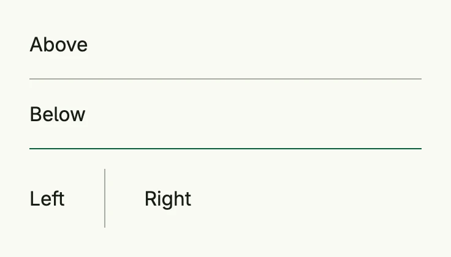

A divider is a hairline which separates sections of content: horizontal in a [VStack](../../layout/vstack/),
vertical in an [HStack](../../layout/hstack/). The default color is derived from the main color of the theme.



```go
return VStack(
	Text("Above"),
	HLine(),
	Text("Below"),
	HLineWithColor(ColorAccent),
	HStack(
		Text("Left"),
		VLine(),
		Text("Right"),
	).Gap(L16).Frame(Frame{Height: L48}),
).Alignment(Leading).Frame(Frame{Width: L320})
```

A horizontal line takes the full width of its parent and a vertical line the full height, so the parent needs a
size.

## Constructors

| Constructor | Description |
|-------------|-------------|
| `HLine() TDivider` | Creates a horizontal hairline divider in the line color of the theme. |
| `HLineWithColor(c Color) TDivider` | Creates a horizontal hairline divider in the given color. |
| `VLine() TDivider` | Creates a vertical hairline divider in the line color of the theme. |
| `VLineWithColor(c Color) TDivider` | Creates a vertical hairline divider in the given color. |

## Methods

| Method | Description |
|--------|-------------|
| `Border(border Border) TDivider` | Sets the border styling of the divider, typically its line thickness and color. |
| `Frame(frame Frame) TDivider` | Sets the layout frame of the divider, including size and positioning. |
| `Padding(padding Padding) TDivider` | Sets the spacing around the divider. |
| `Visible(visible bool) TDivider` | Hides the divider if set to false. |

## Related

- [Border](../border/), [Space](../../layout/space/)
- Tutorials: [Combining views](/docs/examples/tutorial-02-combining-views/), [Buttons](/docs/examples/tutorial-11-buttons/)
