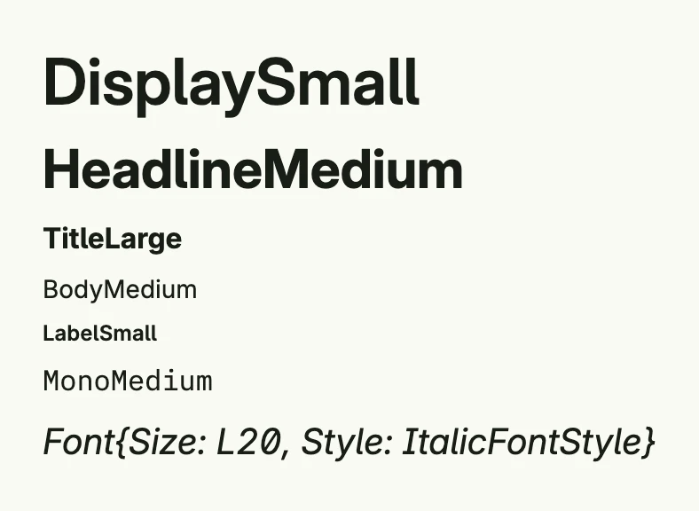

A `Font` sets the family, size, style, weight and line height of text. Use the predefined fonts of the design
system, which follow a type scale from `DisplayLarge` down to `LabelSmall`, or define your own. Texts, buttons,
stacks and other components take it through their `Font` method; a stack passes it on to the texts inside.



```go
return VStack(
	Text("DisplaySmall").Font(DisplaySmall),
	Text("HeadlineMedium").Font(HeadlineMedium),
	Text("TitleLarge").Font(TitleLarge),
	Text("BodyMedium").Font(BodyMedium),
	Text("LabelSmall").Font(LabelSmall),
	Text("MonoMedium").Font(MonoMedium),
	Text("Font{Size: L20, Style: ItalicFontStyle}").Font(Font{Size: L20, Style: ItalicFontStyle}),
).Alignment(Leading).Gap(L8)
```

## Predefined fonts

| Group | Variables |
|-------|-----------|
| Display | `DisplayLarge`, `DisplayMedium`, `DisplaySmall` |
| Headline | `HeadlineLarge`, `HeadlineMedium`, `HeadlineSmall` |
| Title | `TitleLarge`, `TitleMedium`, `TitleSmall` |
| Body | `BodyLarge`, `BodyMedium`, `BodySmall` |
| Label | `LabelLarge`, `LabelMedium`, `LabelSmall` |
| Monospace | `MonoLarge`, `MonoMedium`, `MonoSmall`, `MonoBoldLarge`, `MonoBoldMedium`, `MonoBoldSmall`, `MonoItalicLarge`, `MonoItalicMedium`, `MonoItalicSmall` |
| Older names | `Title`, `SubTitle`, `Large`, `Small`, `Monospace` |

## Fields

| Field | Description |
|-------|-------------|
| `Name FontName` | Font family, e.g. `DefaultFontName` (Inter) or `MonoFontName` (IBM Plex Mono). |
| `Size Length` | Font size as a [Length](../length/). |
| `Style FontStyle` | `NormalFontStyle` or `ItalicFontStyle`. |
| `Weight FontWeight` | Numeric weight, e.g. `BodyFontWeight` (400) or `HeadlineAndTitleFontWeight` (700). |
| `LineHeight LineHeight` | Line height as a CSS value. |

`Font` has no methods.

## Related

- [Text](../../basic/text/), [Text Layout](../../layout/text_layout/)
- Tutorials: [Custom font](/docs/examples/tutorial-60-customfont/), [Font variations](/docs/examples/tutorial-65-font-variations/),
  [Typography](/docs/examples/tutorial-111-typography/)
