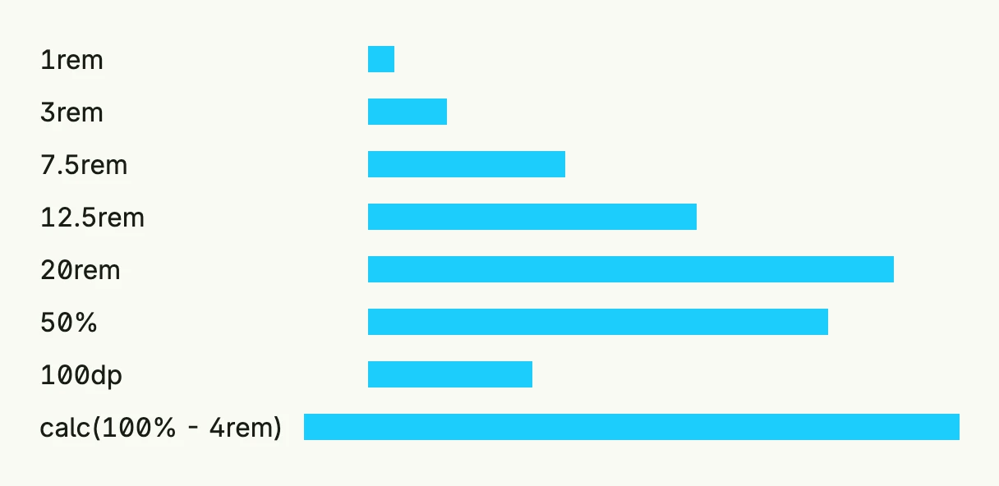

A `Length` is a size used by frames, paddings, gaps, borders and fonts. It is a string with a CSS-like unit. Prefer
the predefined constants `L0` to `L1600`: they are in `rem` and scale with the user's font size, e.g. `L16` is
`1rem`, about 16dp at the default font size. The empty string means automatic.



```go
lengths := []Length{L16, L48, L120, L200, L320, Relative(0.5), Absolute(100), "calc(100% - 4rem)"}

return VStack(
	ForEach(lengths, func(l Length) core.View {
		return HStack(
			Text(string(l)).Frame(Frame{Width: L200}),
			VStack().BackgroundColor("#1CCDFB").Frame(Frame{Width: l, Height: L16}),
		).Alignment(Leading).Frame(Frame{Width: L560})
	})...,
).Alignment(Leading).Gap(L8)
```

Supported values are absolute units in `dp` (`42dp`), `rem` (`0.75rem`), percent (`42%`), `100dvh` (the constant
`ViewportHeight`) and `calc` expressions with these units. `L1` is a hairline of `1px`. Other values are passed to
the browser unchecked and their behavior is undefined.

## Constructors

| Function | Description |
|----------|-------------|
| `L(dip float64) Length` | Converts a size in dp at the default font size into `rem`, e.g. `L(24)` is `1.50rem`. |
| `Absolute(v core.DP) Length` | Creates a fixed size in dp, which does not scale with the font size. |
| `Relative(v core.Weight) Length` | Creates a size relative to the parent, e.g. `Relative(0.5)` is `50%`; the constant `Full` is `100%`. |

Relative sizes only take effect if the parent has a size of its own.

## Methods

| Method | Description |
|--------|-------------|
| `Estimate() core.DP` | Estimates the size in dp; this is only an estimation. |
| `Mul(s float64) Length` | Multiplies the number of the length by `s`, keeping its unit. |
| `Negate() Length` | Returns the negative length. |

## Related

- [Frame](../../layout/frame/), [Padding](../padding/), [Space](../../layout/space/)
- Tutorials: [Combining views](/docs/examples/tutorial-02-combining-views/), [Absolute positions](/docs/examples/tutorial-41-absolute/)
