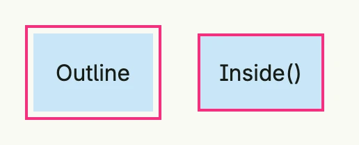

An `Outline` draws a line around a component like a [Border](../border/), but it takes no space in the layout and
can be moved away from the edge by an offset. Stacks use it for focus, hover and pressed states.



```go
return HStack(
	VStack(Text("Outline")).
		Outline(Outline{Style: OutlineSolid, Width: 2, Offset: 4, Color: "#FA2C7F"}).
		BackgroundColor("#C9E7F8").
		Padding(Padding{}.All(L16)),
	VStack(Text("Inside()")).
		Outline(Outline{Style: OutlineSolid, Width: 2, Color: "#FA2C7F"}.Inside()).
		BackgroundColor("#C9E7F8").
		Padding(Padding{}.All(L16)),
).Gap(L32).Padding(Padding{}.All(L16))
```

## Fields

| Field | Description |
|-------|-------------|
| `Style OutlineStyle` | `OutlineSolid` or `OutlineDotted`. |
| `Width int` | Line width in pixels. |
| `Offset int` | Distance between the edge and the outline in pixels. |
| `Color Color` | Line [color](../color/). |

## Methods

| Method | Description |
|--------|-------------|
| `Inside() Outline` | Sets the outline to be inside the element. |

## Related

- [Border](../border/), [Stack](../../layout/stack/) (`Outline`, `FocusedOutline`, `HoveredOutline`, `PressedOutline`)
- Tutorials: [Icons](/docs/examples/tutorial-10-icons/), [Text field](/docs/examples/tutorial-12-textfield/)
