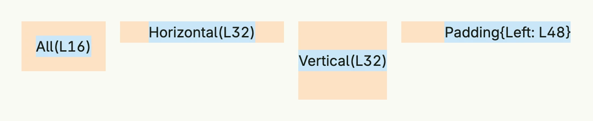

A `Padding` is the space between the edge of a component and its content, defined per side. Start with the zero
value and use the setters, or set the fields `Top`, `Left`, `Right` and `Bottom` directly.



```go
return HStack(
	VStack(Text("All(L16)").BackgroundColor("#C9E7F8")).
		BackgroundColor("#FDE2C4").
		Padding(Padding{}.All(L16)),
	VStack(Text("Horizontal(L32)").BackgroundColor("#C9E7F8")).
		BackgroundColor("#FDE2C4").
		Padding(Padding{}.Horizontal(L32)),
	VStack(Text("Vertical(L32)").BackgroundColor("#C9E7F8")).
		BackgroundColor("#FDE2C4").
		Padding(Padding{}.Vertical(L32)),
	VStack(Text("Padding{Left: L48}").BackgroundColor("#C9E7F8")).
		BackgroundColor("#FDE2C4").
		Padding(Padding{Left: L48}),
).Gap(L16).Alignment(Top)
```

The orange area is the padding of each stack, the blue area its content.

## Methods

| Method | Description |
|--------|-------------|
| `All(pad Length) Padding` | Applies the same padding value to all four sides. |
| `Horizontal(pad Length) Padding` | Sets the padding for the horizontal axis (left and right). |
| `Vertical(pad Length) Padding` | Sets the padding for the vertical axis (top and bottom). |

The setters can be combined: `Padding{}.Horizontal(L16).Vertical(L8)`.

## Related

- [Length](../length/), [Frame](../../layout/frame/), [Space](../../layout/space/)
- Tutorials: [Combining views](/docs/examples/tutorial-02-combining-views/), [Box](/docs/examples/tutorial-03-box/)
