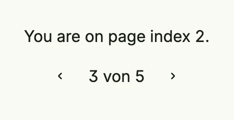

The pager of package [`pager`](https://github.com/worldiety/nago/tree/main/presentation/ui/pager) shows the
current page and buttons for the previous and next page. It changes a state with the zero-based index of the
current page; you load and show the entries of that page yourself.



```go
pageIdx := core.AutoState[int](wnd).Init(func() int {
	return 2
})

return VStack(
	Text(fmt.Sprintf("You are on page index %d.", pageIdx.Get())),
	pager.Pager(pageIdx).Count(5),
).Gap(L8)
```


The page label ("3 von 5") is currently a fixed German text.


For lists of entities, `pager.NewModel` combines paging with a quick filter and a selection. Its field `PageIdx`
is the state to pass to the pager, and `Page` contains the entities of the current page.

## Constructors

| Constructor | Description |
|-------------|-------------|
| `pager.Pager(pageIdx *core.State[int]) TPager` | Creates a new pager with the given state of the zero-based page index. |
| `pager.NewModel[E, ID](wnd core.Window, findByID data.ByIDFinder[E, ID], it iter.Seq2[ID, error], opts ModelOptions) (Model[E, ID], error)` | Creates a model with paging, quick filter and selection for the given entities. |

## Methods

| Method | Description |
|--------|-------------|
| `Count(count int) TPager` | Sets the number of available pages; with 0 or less a single page is still shown. |
| `Frame(frame ui.Frame) TPager` | Sets the frame of the pager. |
| `Visible(v bool) TPager` | Hides the pager if set to false. |

## Related

- [Table](../../composite/table/), [List](../../composite/list/), [Tabs](../tabs/)
