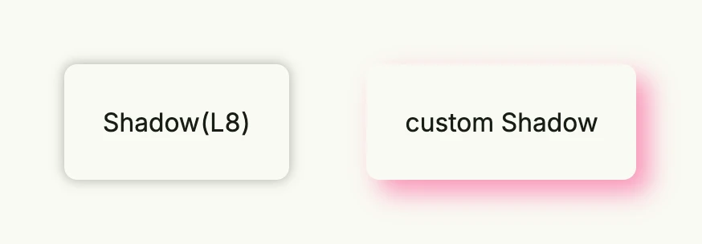

A `Shadow` describes a box shadow: its color, blur radius and offset. It is part of a [Border](../border/), either
set with the shortcuts `Border.Shadow` and `Border.Elevate` or through the `BoxShadow` field.



```go
return HStack(
	Text("Shadow(L8)").Padding(Padding{}.All(L24)).
		Border(Border{}.Radius(L8).Shadow(L8)),
	Text("custom Shadow").Padding(Padding{}.All(L24)).
		Border(Border{
			TopLeftRadius:     L8,
			TopRightRadius:    L8,
			BottomLeftRadius:  L8,
			BottomRightRadius: L8,
			BoxShadow: Shadow{
				Color:  "#FA2C7F80",
				Radius: L16,
				X:      L8,
				Y:      L8,
			},
		}),
).Gap(L48).Padding(Padding{}.All(L32))
```

Containers clip their children, so leave enough padding around a component with a shadow.

## Fields

| Field | Description |
|-------|-------------|
| `Color Color` | Shadow color, usually semi-transparent. |
| `Radius Length` | Blur radius of the shadow. |
| `X`, `Y Length` | Horizontal and vertical offset. |

`Shadow` has no methods.

## Related

- [Border](../border/), [Color](../color/)
