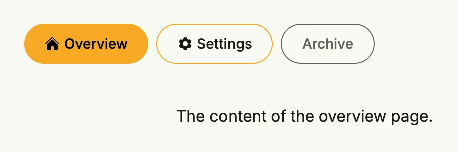

Tabs of package [`tabs`](https://github.com/worldiety/nago/tree/main/presentation/ui/tabs) show a row of tab
buttons and the content of the active [page](../page/). Only the active page is built, because each page creates
its content in a function.



```go
return tabs.Tabs(
	tabs.Page("Overview", func() core.View {
		return Text("The content of the overview page.")
	}).Icon(icons.Home),
	tabs.Page("Settings", func() core.View {
		return Text("The content of the settings page.")
	}).Icon(icons.Cog6Tooth),
	tabs.Page("Archive", func() core.View {
		return Text("Not available yet.")
	}).Disabled(true),
).InputValue(core.AutoState[int](wnd)).
	Frame(Frame{Width: L560})
```

The state holds the index of the active page. With `tabs.NewIndexState(wnd, name)` the index is kept in the query
parameter `<name>-idx`, so the active tab survives reloads and can be linked.

## Constructors

| Constructor | Description |
|-------------|-------------|
| `tabs.Tabs(pages ...TPage) TTabs` | Creates a new tab container with the given pages, defaulting to leading alignment and a standard page-to-tab spacer. |
| `tabs.NewIndexState(wnd core.Window, name string) *core.State[int]` | Creates an index state which is passed through the query parameter `<name>-idx`. |

## Methods

| Method | Description |
|--------|-------------|
| `ButtonAlignment(tabAlignment ui.Alignment) TTabs` | Sets the alignment of the tab buttons within the button bar. |
| `Frame(frame ui.Frame) TTabs` | Sets the layout frame of the tabs container, including size and spacing. |
| `FullWidth() TTabs` | Sets the tabs container to span the full available width. |
| `InputValue(activeIdx *core.State[int]) TTabs` | Binds the tab container to an external state that tracks the index of the currently active page. |
| `PageTabSpace(space ui.Length) TTabs` | Sets the space between the tab button bar and the page content, `L32` by default; `""` disables it. |
| `Position(pos ui.Position) TTabs` | Sets the [position](../../layout/position/) of the tabs container. |

## Related

- [Page](../page/), [Switcher](../../layout/switcher/), [Pager](../pager/)
