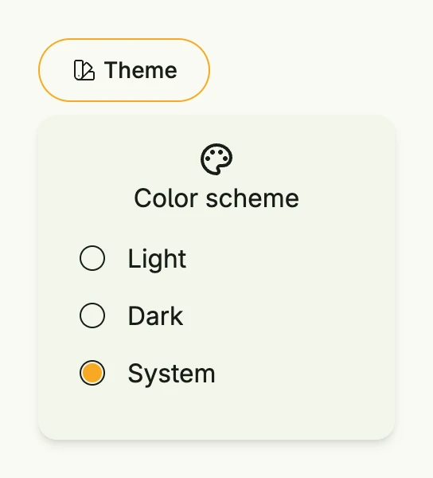

The theme switcher opens a menu at the given anchor view in which the user chooses the color scheme: light,
dark or the setting of the system. The choice is applied to the window with `wnd.SetColorScheme` immediately.
Put it into a toolbar or the menu of your [Scaffold](../../composite/scaffold/).



```go
ThemeSwitcher(SecondaryButton(nil).PreIcon(icons.Swatch).Title("Theme"))
```

The texts of the menu are the localized strings `StrTheme`, `StrThemeLight`, `StrThemeDark` and
`StrThemeSystem` of package `ui`.

## Constructors

| Constructor | Description |
|-------------|-------------|
| `func ThemeSwitcher(anchor core.View) TThemeSwitcher` | ThemeSwitcher creates a new theme switching menu with the given anchor. |

## Methods

| Method | Description |
|--------|-------------|
| `Frame(frame Frame) TThemeSwitcher` | Frame sets the layout frame of the menu. |

## Related

- [Menu](../../composite/menu/), [Colors](../colorset/)
- Concepts: [Theming](/docs/concepts/theming/)
- Tutorials: [Theme switch](/docs/examples/tutorial-102-theme-switch/), [Scaffold](/docs/examples/tutorial-17-scaffold/)
