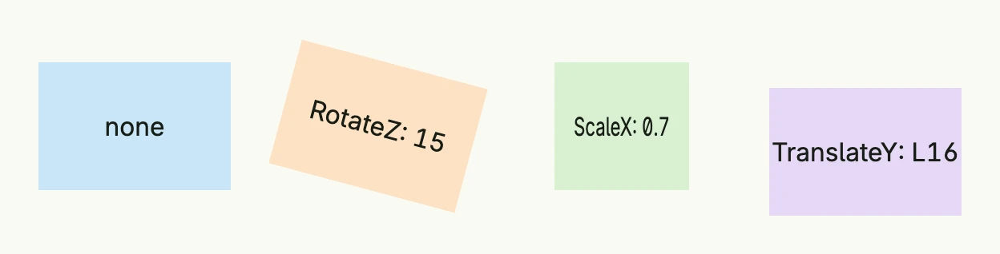

A `Transformation` moves, scales or rotates a [stack](../../layout/stack/) after layout, without affecting the
position of its neighbors. Combined with the `AnimateTransition` [animation](../animation/), changes of the
transformation are animated.



```go
return HStack(
	VStack(Text("none")).
		BackgroundColor("#C9E7F8").
		Frame(Frame{}.Size(L120, L80)),
	VStack(Text("RotateZ: 15")).
		Transformation(Transformation{RotateZ: 15}).
		BackgroundColor("#FDE2C4").
		Frame(Frame{}.Size(L120, L80)),
	VStack(Text("ScaleX: 0.7")).
		Transformation(Transformation{ScaleX: 0.7, ScaleY: 1}).
		BackgroundColor("#D8F0D2").
		Frame(Frame{}.Size(L120, L80)),
	VStack(Text("TranslateY: L16")).
		Transformation(Transformation{TranslateY: L16}).
		BackgroundColor("#E5D8F6").
		Frame(Frame{}.Size(L120, L80)),
).Gap(L32).Padding(Padding{}.All(L16))
```

## Fields

| Field | Description |
|-------|-------------|
| `TranslateX`, `TranslateY`, `TranslateZ Length` | Moves the component. |
| `ScaleX`, `ScaleY`, `ScaleZ float64` | Scales the component; 1 is the original size. |
| `RotateZ float64` | Rotates the component clockwise, in degrees. |

`Transformation` has no methods.

## Related

- [Animation](../animation/), [Stack](../../layout/stack/)
- Tutorials: [Animation](/docs/examples/tutorial-73-animation/)
