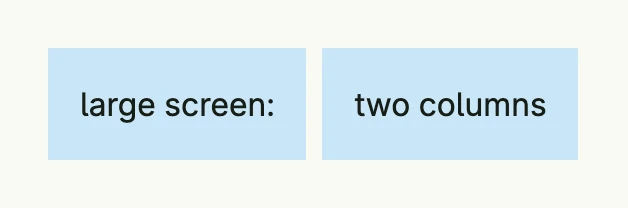
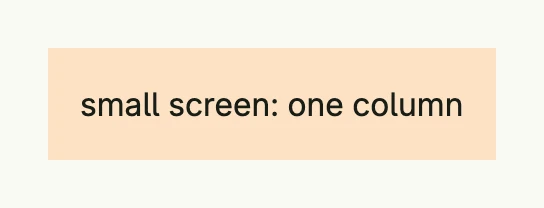

View that matches renders one of several views depending on the window size class, e.g. a compact view for phones
and a richer one for desktops. It picks the view of the largest size class which still fits the window. The views
are created lazily, so only the chosen one is built.

| Window 1200dp wide | Window 400dp wide |
|--------------------|-------------------|
|  |  |

```go
return ViewThatMatches(wnd,
	SizeClass(core.SizeClassSmall, func() core.View {
		return Text("small screen: one column").BackgroundColor("#FDE2C4").Padding(Padding{}.All(L16))
	}),
	SizeClass(core.SizeClassLarge, func() core.View {
		return HStack(
			Text("large screen:").BackgroundColor("#C9E7F8").Padding(Padding{}.All(L16)),
			Text("two columns").BackgroundColor("#C9E7F8").Padding(Padding{}.All(L16)),
		).Gap(L8)
	}),
)
```

The size classes are `core.SizeClassSmall` (below 768dp), `SizeClassMedium` (from 768dp), `SizeClassLarge`
(from 1024dp), `SizeClassXL` (from 1280dp) and `SizeClass2XL` (from 1536dp). For a simple switch between rows and
columns, [Stack](../../layout/stack/) is enough.

## Constructors

| Constructor | Description |
|-------------|-------------|
| `ViewThatMatches(wnd core.Window, matches ...ViewWithSizeClass) TViewThatMatches` | Creates a view which renders the best match for the window; it panics without matches. |
| `SizeClass(class core.WindowSizeClass, view func() core.View) ViewWithSizeClass` | Associates a view factory with a size class. |

## Methods

`TViewThatMatches` has no methods besides `Render`.

## Related

- [Stack](../../layout/stack/), [Card Layout](../../layout/card_layout/), [Conditional rendering](../conditionals/)
- Tutorials: [Responsive](/docs/examples/tutorial-06-responsive/)
