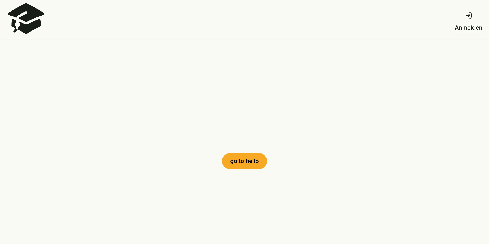

## Root views

A page of a Nago application is called a root view. You register each one with a path and a factory:

```go
cfg.RootView(".", func(wnd core.Window) core.View { ... })            // the start page at /
cfg.RootView("orders", func(wnd core.Window) core.View { ... })       // /orders
cfg.RootView("orders/details", func(wnd core.Window) core.View { ... })
```

- `.` is the start page. Other paths must not start or end with a slash.
- Paths become part of the URL. Users bookmark them, so treat them as a public contract.
- There are no path variables. Pass parameters as `core.Values`, a `map[string]string`, which appear as query
  parameters in the URL and which the target page reads with `wnd.Values()`.
- Registering the same path twice panics.

`cfg.RootView` accepts options; `application.Purpose("review and settle open invoices")` describes in one
sentence what a user does on the page, which the AI assistant uses as context.

## Navigating

`wnd.Navigation()` returns the `core.Navigation` of the window:

| Method                        | Effect                                                                     |
|-------------------------------|----------------------------------------------------------------------------|
| `ForwardTo(path, values)`     | opens another root view and adds it to the browser history                 |
| `Back()`                      | goes back in the history                                                   |
| `Replace(path, values)`       | opens another root view and replaces the current history entry             |
| `ResetTo(path, values)`       | opens another root view and resets the history                             |
| `Reload()`                    | reloads the current page                                                   |
| `Open(uri)`                   | opens an external resource, e.g. a URL in a new tab                        |

```go
cfg.RootView(".", func(wnd core.Window) core.View {
	return ui.PrimaryButton(func() {
		wnd.Navigation().ForwardTo("hello", core.Values{"msg": "world"})
	}).Title("go to hello")
})

cfg.RootView("hello", func(wnd core.Window) core.View {
	return ui.Text("your message is " + wnd.Values()["msg"])
})
```

Values are visible and editable in the URL. Never trust them: check permissions in your use cases, not by
hiding links.

## Decorators and the scaffold

Most applications show the same frame around each page: a logo, a menu, a login button and a footer. In Nago,
this frame is a decorator, a `func(wnd core.Window, view core.View) core.View` which wraps the view of a root
view.

`cfg.NewScaffold()` builds the standard decorator. Set it as the application decorator and register your pages
with `RootViewWithDecoration`, which is short for `RootView(path, cfg.DecorateRootView(factory))`:

```go
cfg.SetDecorator(cfg.NewScaffold().
	Logo(ui.Image().Embed(heroSolid.AcademicCap).Frame(ui.Frame{}.Size(ui.L96, ui.L96))).
	MenuEntry().Title("Orders").Forward("orders").Private().
	MenuEntry().Title("Reports").Forward("reports").OneOf(PermReadReports).
	Decorator())

cfg.RootViewWithDecoration(".", func(wnd core.Window) core.View { ... })
```



Each `MenuEntry()` is configured with `Title`, `Icon`, `Forward` or `Action` and completed by its visibility:

| Method          | The entry is visible for                                    |
|-----------------|-------------------------------------------------------------|
| `Public()`      | everybody                                                   |
| `PublicOnly()`  | users which are not logged in                               |
| `Private()`     | users which are logged in                                   |
| `OneOf(perms…)` | users with at least one of the given permissions            |
| `OneOfRole(…)`  | users with at least one of the given roles                  |

`SubmenuEntry` creates a sub menu. The scaffold also shows the login or profile button (switch it off with
`Login(false)`), a link to the admin center for users who may see it, and a footer. `Breakpoint` sets the window
width below which the menu collapses into a burger menu.


Menu visibility is a convenience, not a security measure. A user can enter any path directly. Protect the data
in your [use cases](../use-cases-and-permissions/).


The pages of the built-in systems, like the admin center or the login page, use the same decorator. If you want
full control in a single page instead, build the layout yourself with the
[Scaffold component](/docs/components/composite/scaffold/), see
[tutorial-17-scaffold](/docs/examples/tutorial-17-scaffold/).

## Related

- [tutorial-46-rootviews](/docs/examples/tutorial-46-rootviews/)
- [tutorial-52-scaffoldbuilder](/docs/examples/tutorial-52-scaffoldbuilder/)
- [tutorial-87-navsplitview](/docs/examples/tutorial-87-navsplitview/)
