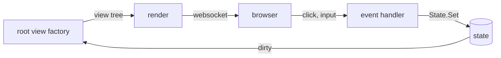

## The render cycle

Each browser tab opens a websocket connection to your server and gets its own `core.Window`. When the tab shows a
page, Nago calls the factory of the [root view](../navigation/) and renders the returned view tree into a
description which the frontend displays.

This happens again and again: after the frontend sent an event, e.g. a click or an input, and whenever a state of
the window has changed. Each render calls your factory function from scratch and builds a completely new tree.
You never modify views in place; you change state and let Nago render again.



Consequences for your code:

- A factory must be fast and free of side effects. Do not load data from slow sources on each render, see
  [Loading data](#loading-data).
- Local variables of the factory are lost after the render. Everything which must survive a render belongs into
  a `core.State`.
- Callbacks like a button action are only valid for the tree they were rendered with.

## core.State

A `*core.State[T]` holds a value of type `T` across renders. It belongs to the window and is removed as soon as a
render no longer asks for it. There are two ways to get one:

```go
count := core.AutoState[int](wnd)               // identified by its position in the code
name := core.StateOf[string](wnd, "name")       // identified by an explicit id
```

`AutoState` derives the identity from the call site. This is convenient, but it fails if the same line is
executed several times within one render, e.g. in a loop or a helper function which is called repeatedly: then
all calls get the same state. Use `StateOf` with a unique id in these cases, or `core.DerivedState` to derive
ids from a parent state.

The most important methods:

| Method              | Purpose                                                                                       |
|---------------------|-----------------------------------------------------------------------------------------------|
| `Get()`             | returns the current value                                                                     |
| `Set(v)`            | sets a new value; if it differs (deep equality), the window is rendered again                 |
| `Init(fn)`          | initializes the value once, as long as the state has never been set                           |
| `AsyncInit(fn)`     | like `Init`, but runs `fn` in the background and renders again when the value arrives         |
| `Observe(fn)`       | registers a callback for changes made by the frontend, e.g. typed text                        |
| `Invalidate()`      | forces a new render, even if the value did not change                                         |
| `Reset()`           | marks the state as unset, so that `Init` and `AsyncInit` run again                            |

## Binding states to components

Input components take a state and update it when the user changes the value. The tree is rendered again with
the new value:

```go
cfg.RootView(".", func(wnd core.Window) core.View {
	name := core.AutoState[string](wnd)
	clicks := core.AutoState[int](wnd)

	return ui.VStack(
		ui.TextField("Your name", name.Get()).InputValue(name),
		ui.Text(fmt.Sprintf("hello %s", name.Get())),
		ui.PrimaryButton(func() {
			clicks.Set(clicks.Get() + 1)
		}).Title(fmt.Sprintf("clicked %d times", clicks.Get())),
	).Gap(ui.L16)
})
```

Note that `TextField` gets the current value and the state: the value is what it displays, the state is where
it writes changes to. See [tutorial-12-textfield](/docs/examples/tutorial-12-textfield/). Dialogs work the same
way: a `*core.State[bool]` controls whether the dialog is presented, see
[tutorial-110-dialog-and-alerts](/docs/examples/tutorial-110-dialog-and-alerts/).

## Loading data

Use `Init` to load data once when the page appears, or `AsyncInit` if loading takes time. With `AsyncInit`, the
page renders immediately with the zero value, so show a progress indicator until `Valid()` returns true:

```go
orders := core.AutoState[[]Order](wnd).AsyncInit(func() []Order {
	return loadOrders(wnd.Subject())
})

if !orders.Valid() {
	return ui.Text("loading ...")
}
```

## Updates from the background

States are safe for concurrent use. If a goroutine sets a state, Nago notices the change on its next update tick
and renders the window again. The tick rate defaults to 10 per second and can be changed with `cfg.SetFPS`.

To run code on the event loop of a window, e.g. to avoid races with a render in progress, use `wnd.Post(fn)` or
`wnd.PostDelayed(fn, delay)`. For work bound to the lifetime of a view, `core.OnAppear` and `core.OnDisappear`
run a function once when the view enters or leaves the tree. To simply redraw at a fixed rate, wrap a view in
`ui.RedrawAtFixedRate`, see [tutorial-24-redraw](/docs/examples/tutorial-24-redraw/).


Do not call `Set` with a changing value, e.g. a timestamp, unconditionally during rendering. Every change causes
another render, so the window renders in an endless loop and discards the actions of the user.


## Related

- [tutorial-23-appear-disappear](/docs/examples/tutorial-23-appear-disappear/)
- [tutorial-53-countdown](/docs/examples/tutorial-53-countdown/)
- [tutorial-91-hydration](/docs/examples/tutorial-91-hydration/)
